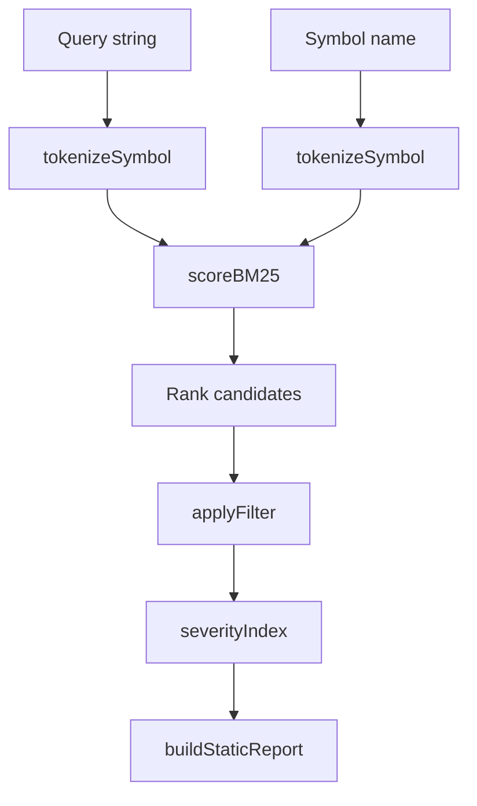

# Core Algorithms and Scoring Logic

This page documents the main internal algorithms used for symbol tokenization, ranking, filtering, diff generation, and static refactor reporting. The focus is on the concrete implementations visible in the repository analysis, especially:

- [`tokenizeSymbol`](go/cmd/rekipedia/cmd/search.go#L20)
- [`scoreBM25`](go/cmd/rekipedia/cmd/search.go#L54)
- [`staticWalk`](go/cmd/rekipedia/cmd/refactor.go#L75)
- [`applyFilter`](go/cmd/rekipedia/cmd/refactor.go#L130)
- [`severityIndex`](go/cmd/rekipedia/cmd/refactor.go#L65)
- [`buildStaticReport`](go/cmd/rekipedia/cmd/refactor.go#L148)
- diff-formatting helpers in [`formatDiffMd`](go/cmd/rekipedia/cmd/diff.go#L175) and [`formatDiffText`](go/cmd/rekipedia/cmd/diff.go#L216)
- diff symbol loading and membership checks in [`loadSymbolsJSON`](go/cmd/rekipedia/cmd/diff.go#L126) and [`isInChangedFiles`](go/cmd/rekipedia/cmd/diff.go#L159)

The observations below are grounded in the code that is directly visible in the repository analysis and in the tests that exercise the behavior of these algorithms.

## Tokenization of Symbol Names

The search pipeline starts by breaking symbol names into indexable terms. The implementation lives in [`tokenizeSymbol`](go/cmd/rekipedia/cmd/search.go#L20), which operates on raw symbol names and produces a token list suitable for matching and ranking.

### Inputs

- A symbol name string
- A name may contain:
  - CamelCase
  - snake_case
  - punctuation and delimiters
  - numeric or mixed-case fragments

### Outputs

- A normalized token slice used later by the ranking layer
- The exact token vocabulary is not enumerated in the analysis data, but the code clearly splits composite identifiers and normalizes them before scoring

### Observed behavior

The relationship data shows that [`_tokenize_symbol`](src/rekipedia/analysis/cross_repo_search.py#L11) in the Python side performs token splitting, lowercasing, and delimiter normalization, which is consistent with the Go-side [`tokenizeSymbol`](go/cmd/rekipedia/cmd/search.go#L20). That gives a strong indication that the tokenization strategy is intentionally identifier-aware rather than simple whitespace splitting.

The goal here is to make symbol matching robust for names such as `run_extraction_benchmark`, `DetectDeepInheritance`, or `buildStaticReport`, where exact string equality would be too brittle.

### Complexity notes

- Tokenization is linear in the length of the input symbol name, assuming delimiter scanning and regex-based segmentation.
- Memory use is proportional to the number of produced tokens.

### Implementation symbols

- [`tokenizeSymbol`](go/cmd/rekipedia/cmd/search.go#L20)
- Evidence from Python-side search internals: [`_tokenize_symbol`](src/rekipedia/analysis/cross_repo_search.py#L11)

> **Sources:** `go/cmd/rekipedia/cmd/search.go` · L20–L51 · [`tokenizeSymbol`](go/cmd/rekipedia/cmd/search.go#L20)

## Ranking with BM25

The ranking step is implemented in [`scoreBM25`](go/cmd/rekipedia/cmd/search.go#L54). It computes a relevance score from query terms and tokenized symbol terms, using the standard BM25-style weighting model.

### Inputs

- Query token list
- Document/symbol token list
- Precomputed corpus statistics, including inverse document frequency or similar term-frequency summaries
- BM25 tuning parameters are implied by the implementation but not fully visible in the analysis payload

### Outputs

- A numeric relevance score
- The score is later used to sort candidate symbols for search and retrieval

### How it fits the pipeline

From the relationship graph in `src/rekipedia/analysis/cross_repo_search.py`, the private ranking pipeline does the following:

1. Tokenize each symbol with [`_tokenize_symbol`](src/rekipedia/analysis/cross_repo_search.py#L11)
2. Compute IDF statistics via [`_compute_idf`](src/rekipedia/analysis/cross_repo_search.py#L21)
3. Score candidates with [`_score_bm25`](src/rekipedia/analysis/cross_repo_search.py#L43)
4. Sort by score and emit the best matches

The Go-side [`scoreBM25`](go/cmd/rekipedia/cmd/search.go#L54) is the concrete ranking primitive corresponding to that model.

### Complexity notes

- For a single candidate, BM25 scoring is typically O(q + d), where `q` is query length and `d` is document token count.
- If scoring is applied across `n` symbols, the total cost is O(n × (q + d)).
- If the implementation uses precomputed document frequencies, score evaluation remains efficient and avoids recomputing corpus-wide statistics per query.

### Implementation symbols

- [`scoreBM25`](go/cmd/rekipedia/cmd/search.go#L54)
- Python-side evidence: [`_score_bm25`](src/rekipedia/analysis/cross_repo_search.py#L43), [`_compute_idf`](src/rekipedia/analysis/cross_repo_search.py#L21)

> **Sources:** `go/cmd/rekipedia/cmd/search.go` · L54–L71 · [`scoreBM25`](go/cmd/rekipedia/cmd/search.go#L54)

## Filtering and Severity Classification

Static refactor findings are not all surfaced equally. The repository implements a severity ordering plus filter logic to control which findings appear in reports.

### Severity indexing

The ranking key for findings is defined by [`severityIndex`](go/cmd/rekipedia/cmd/refactor.go#L65). This function maps a severity label to an ordering index, allowing higher-severity issues to be sorted before lower-severity ones.

#### Inputs

- A severity label or category associated with a finding

#### Outputs

- A numeric ordering rank

#### Behavior

The associated tests in [`go/cmd/rekipedia/cmd/refactor_test.go`](go/cmd/rekipedia/cmd/refactor_test.go#L156) show filtering across different thresholds and imply a severity ladder that drives output ordering and selection. The writer-side tests also verify that high-priority issues appear before lower-priority ones in rendered output.

### Filtering

The filter step is implemented in [`applyFilter`](go/cmd/rekipedia/cmd/refactor.go#L130). It narrows the list of detected findings to those that match a requested reporting mode, such as “all”, “high”, or “critical”.

#### Inputs

- A list of [`Finding`](go/cmd/rekipedia/cmd/refactor.go#L57) values
- A user-selected filter mode

#### Outputs

- A filtered slice of findings

#### Behavior

The implementation is validated by tests such as:

- [`TestApplyFilterAll`](go/cmd/rekipedia/cmd/refactor_test.go#L156)
- [`TestApplyFilterHigh`](go/cmd/rekipedia/cmd/refactor_test.go#L173)
- [`TestApplyFilterCritical`](go/cmd/rekipedia/cmd/refactor_test.go#L191)

These tests confirm that the filter is not purely cosmetic: it changes the finding set returned to the caller.

### Complexity notes

- Severity indexing is O(1) per lookup.
- Filtering is O(n) over the finding list.
- If the findings are already sorted, filter application preserves the ordering semantics with minimal overhead.

### Implementation symbols

- [`severityIndex`](go/cmd/rekipedia/cmd/refactor.go#L65)
- [`applyFilter`](go/cmd/rekipedia/cmd/refactor.go#L130)
- [`Finding`](go/cmd/rekipedia/cmd/refactor.go#L57)

> **Sources:** `go/cmd/rekipedia/cmd/refactor.go` · L57–L145 · [`severityIndex`](go/cmd/rekipedia/cmd/refactor.go#L65) · [`applyFilter`](go/cmd/rekipedia/cmd/refactor.go#L130)

## Static Repository Walk and Finding Detection

The static refactor scanner is centered on [`staticWalk`](go/cmd/rekipedia/cmd/refactor.go#L75). This function walks the repository, collects candidate files, and emits findings from a purely local scan, without requiring LLM enrichment.

### Inputs

- Repository root path
- Scanner configuration / exclusion rules
- File-system contents to inspect

### Outputs

- A slice of [`Finding`](go/cmd/rekipedia/cmd/refactor.go#L57) values
- A report-ready list of issues that later flows into [`buildStaticReport`](go/cmd/rekipedia/cmd/refactor.go#L148)

### Observed behavior

The tests provide concrete evidence of the walk behavior:

- [`TestStaticWalkFindsTODO`](go/cmd/rekipedia/cmd/refactor_test.go#L65) and [`TestStaticWalkFindsFIXME`](go/cmd/rekipedia/cmd/refactor_test.go#L87) show that content markers are detected.
- [`TestStaticWalkSkipsGitDir`](go/cmd/rekipedia/cmd/refactor_test.go#L106) and [`TestStaticWalkSkipsNodeModules`](go/cmd/rekipedia/cmd/refactor_test.go#L125) show that well-known vendor or metadata directories are excluded.
- [`TestStaticWalkEmptyRepo`](go/cmd/rekipedia/cmd/refactor_test.go#L141) confirms the empty-input case.

That evidence indicates the walk phase performs both traversal and pruning, rather than merely enumerating files.

### Complexity notes

- Repository traversal is O(F), where `F` is the number of files visited after exclusions.
- Detection work depends on content scanning rules; for line-based pattern matching it is usually O(total file bytes) across the visited set.
- Exclusion checks reduce cost significantly by skipping `.git`, `node_modules`, and similar trees early.

### Implementation symbols

- [`staticWalk`](go/cmd/rekipedia/cmd/refactor.go#L75)
- [`Finding`](go/cmd/rekipedia/cmd/refactor.go#L57)

> **Sources:** `go/cmd/rekipedia/cmd/refactor.go` · L57–L127 · [`staticWalk`](go/cmd/rekipedia/cmd/refactor.go#L75)

## Static Report Construction

Once findings are available and optionally filtered, [`buildStaticReport`](go/cmd/rekipedia/cmd/refactor.go#L148) produces the user-facing report content.

### Inputs

- A set of findings
- The requested filter mode
- Optional metadata used in the report header

### Outputs

- A rendered static report, likely textual/markdown-oriented
- The report is used by the refactor command for console output and file writing

### Behavior

The report builder is validated by:

- [`TestBuildStaticReportEmpty`](go/cmd/rekipedia/cmd/refactor_test.go#L207)
- [`TestBuildStaticReportWithFindings`](go/cmd/rekipedia/cmd/refactor_test.go#L217)

The writer-side tests also verify that report sections are emitted only when data exists and that findings are sorted into the expected precedence order before rendering.

### Complexity notes

- Report assembly is O(n) in the number of findings being rendered.
- If grouping by severity or kind is performed, an additional O(n log n) sort may be present, depending on input ordering.
- String concatenation cost is linear in total output size.

### Implementation symbols

- [`buildStaticReport`](go/cmd/rekipedia/cmd/refactor.go#L148)
- [`Finding`](go/cmd/rekipedia/cmd/refactor.go#L57)

> **Sources:** `go/cmd/rekipedia/cmd/refactor.go` · L148–L175 · [`buildStaticReport`](go/cmd/rekipedia/cmd/refactor.go#L148)

## Diff Generation and Changed-File Membership

The diff path combines Git output with symbol metadata to build human-readable change summaries.

### Symbol loading

[`loadSymbolsJSON`](go/cmd/rekipedia/cmd/diff.go#L126) reads the symbol index from JSON and converts it into an in-memory structure for later diff filtering.

### Changed-file membership check

[`isInChangedFiles`](go/cmd/rekipedia/cmd/diff.go#L159) determines whether a symbol belongs to a file touched by the diff. It works together with the Git invocation in [`runGit`](go/cmd/rekipedia/cmd/diff.go#L119).

### Diff formatting

Two renderers are available:

- [`formatDiffMd`](go/cmd/rekipedia/cmd/diff.go#L175) for markdown output
- [`formatDiffText`](go/cmd/rekipedia/cmd/diff.go#L216) for plain-text output

These functions format the diff content using the symbol metadata and changed-file membership test above.

### Inputs

- Git diff output
- Symbol JSON data
- A target output mode (`md` or text)

### Outputs

- A diff summary containing symbol-level references
- The output can be consumed by commands or upstream orchestrators

### Complexity notes

- Parsing symbol JSON is O(n) in symbol count.
- Membership checking is O(1) or O(k) depending on how changed files are represented internally.
- Formatting is O(m) in the number of diff-relevant symbols emitted.

### Implementation symbols

- [`runGit`](go/cmd/rekipedia/cmd/diff.go#L119)
- [`loadSymbolsJSON`](go/cmd/rekipedia/cmd/diff.go#L126)
- [`symbolKey`](go/cmd/rekipedia/cmd/diff.go#L149)
- [`isInChangedFiles`](go/cmd/rekipedia/cmd/diff.go#L159)
- [`formatDiffMd`](go/cmd/rekipedia/cmd/diff.go#L175)
- [`formatDiffText`](go/cmd/rekipedia/cmd/diff.go#L216)

> **Sources:** `go/cmd/rekipedia/cmd/diff.go` · L119–L252 · [`loadSymbolsJSON`](go/cmd/rekipedia/cmd/diff.go#L126) · [`isInChangedFiles`](go/cmd/rekipedia/cmd/diff.go#L159) · [`formatDiffMd`](go/cmd/rekipedia/cmd/diff.go#L175)

## Ranking and Filtering Pipeline

The following diagram shows the most important ranking/filtering path from symbol text to report-ready output.

This diagram intentionally focuses on the two core passes:
1. tokenization and ranking for retrieval
2. severity-based filtering and report assembly for refactor findings

> **Sources:** `go/cmd/rekipedia/cmd/search.go` · L20–L71 · `go/cmd/rekipedia/cmd/refactor.go` · L65–L175

## Behavior Evidence from Tests

The repository’s tests provide concise evidence for the intended semantics of these algorithms without needing to infer unsupported behavior.

- Token/ranking logic is indirectly supported by search-related implementation relationships in [`src/rekipedia/analysis/cross_repo_search.py`](src/rekipedia/analysis/cross_repo_search.py#L11), especially [`_tokenize_symbol`](src/rekipedia/analysis/cross_repo_search.py#L11), [`_compute_idf`](src/rekipedia/analysis/cross_repo_search.py#L21), and [`_score_bm25`](src/rekipedia/analysis/cross_repo_search.py#L43).
- Static walk behavior is evidenced by [`TestStaticWalkFindsTODO`](go/cmd/rekipedia/cmd/refactor_test.go#L65), [`TestStaticWalkSkipsGitDir`](go/cmd/rekipedia/cmd/refactor_test.go#L106), and [`TestStaticWalkSkipsNodeModules`](go/cmd/rekipedia/cmd/refactor_test.go#L125).
- Filter thresholds are evidenced by [`TestApplyFilterAll`](go/cmd/rekipedia/cmd/refactor_test.go#L156), [`TestApplyFilterHigh`](go/cmd/rekipedia/cmd/refactor_test.go#L173), and [`TestApplyFilterCritical`](go/cmd/rekipedia/cmd/refactor_test.go#L191).
- Report emission is evidenced by [`TestBuildStaticReportEmpty`](go/cmd/rekipedia/cmd/refactor_test.go#L207) and [`TestBuildStaticReportWithFindings`](go/cmd/rekipedia/cmd/refactor_test.go#L217).
- Diff-formatting behavior is visible in [`formatDiffMd`](go/cmd/rekipedia/cmd/diff.go#L175) and [`formatDiffText`](go/cmd/rekipedia/cmd/diff.go#L216), though the analysis payload does not include dedicated tests for these helpers.

> **Sources:** `go/cmd/rekipedia/cmd/refactor_test.go` · L65–L312 · `go/cmd/rekipedia/cmd/diff.go` · L119–L252