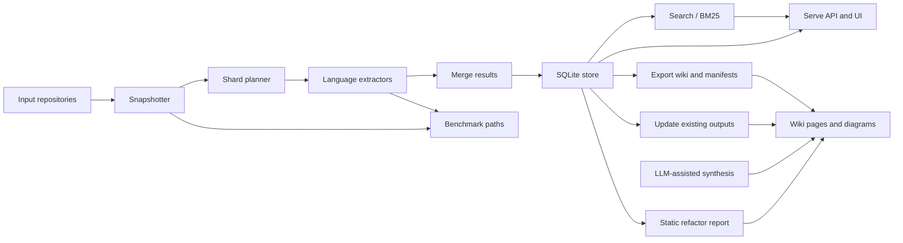

# Architecture Overview

## High-Level System Shape

The repository is organized around a pipeline that starts with one or more input repositories, scans them into structured symbols and relationships, stores the results, and then exposes those results through search, serving, export/update, and benchmark flows. The core orchestration is split between Go services and commands in `go/cmd/rekipedia`, reusable analysis and persistence code under `go/internal`, and a smaller Python surface for benchmark fixtures and some analysis tooling. The architecture is intentionally modular: scanners and extractors produce normalized model objects, storage persists them, synthesis/export layers turn them into wiki pages and graphs, and the server and CLI expose different consumer-facing entry points.

At the top of the CLI stack, [`Execute`](go/cmd/rekipedia/cmd/root.go#L44) wires the Cobra command tree together, while [`main`](go/cmd/rekipedia/main.go#L6) is the process entry point. The scan/update/export/search/serve commands all sit below that root, each delegating to orchestrator or internal service packages rather than implementing business logic directly. For example, the extraction benchmark runner [`run_extraction_benchmark`](benchmarks/run_extraction.py#L19) is a Python-side harness focused on validating extractor quality, and the refactor command’s [`buildStaticReport`](go/cmd/rekipedia/cmd/refactor.go#L148) turns detected issues into a static summary without needing the full LLM-assisted pipeline.

> **Sources:** `go/cmd/rekipedia/main.go` · L6–L8 · [`main`](go/cmd/rekipedia/main.go#L6) · `go/cmd/rekipedia/cmd/root.go` · L44–L48 · [`Execute`](go/cmd/rekipedia/cmd/root.go#L44) · `go/internal/orchestrator/snapshotter.go` · L89–L172 · [`Snapshotter.Snapshot`](go/internal/orchestrator/snapshotter.go#L89) · `go/internal/orchestrator/sharding.go` · L39–L114 · [`ShardPlanner.Plan`](go/internal/orchestrator/sharding.go#L39) · `go/internal/extractor/extractor.go` · L37–L68 · [`Registry.ExtractFile`](go/internal/extractor/extractor.go#L37) · `go/internal/storage/store.go` · L170–L356 · [`SaveSymbols`](go/internal/storage/store.go#L170) · [`ListWikiPages`](go/internal/storage/store.go#L291) · `go/internal/server/server.go` · L71–L926 · [`Server.Start`](go/internal/server/server.go#L71) · [`handleAPIWikiSearch`](go/internal/server/server.go#L802) · `go/internal/exporter/json_exporter.go` · L49–L140 · [`JSONExporter.Export`](go/internal/exporter/json_exporter.go#L49) · `go/internal/exporter/markdown_exporter.go` · L22–L63 · [`MarkdownExporter.Export`](go/internal/exporter/markdown_exporter.go#L22) · `go/internal/orchestrator/run_digest.go` · L48–L364 · [`RunDigest`](go/internal/orchestrator/run_digest.go#L48) · `go/internal/orchestrator/run_update.go` · L30–L179 · [`RunUpdate`](go/internal/orchestrator/run_update.go#L30) · `benchmarks/run_extraction.py` · L19–L142 · [`run_extraction_benchmark`](benchmarks/run_extraction.py#L19) · `go/cmd/rekipedia/cmd/refactor.go` · L148–L175 · [`buildStaticReport`](go/cmd/rekipedia/cmd/refactor.go#L148)

## Component Responsibilities

### CLI and Command Layer

The command layer is a thin shell over the core packages. [`Execute`](go/cmd/rekipedia/cmd/root.go#L44) initializes the root command, while the subcommands in `go/cmd/rekipedia/cmd` primarily parse intent and forward work elsewhere. This is visible in commands like [`runGit`](go/cmd/rekipedia/cmd/diff.go#L119), which shells out to Git for diff-aware behavior, and [`buildStaticReport`](go/cmd/rekipedia/cmd/refactor.go#L148), which composes an analysis report without requiring network calls or persistent state. The design implies a deliberate separation between “command wiring” and “domain execution.”

[`main`](go/cmd/rekipedia/main.go#L6) is especially minimal, which is a strong signal that the repo prefers an explicit command tree over hidden startup logic. That keeps the user entry points predictable and makes testing easier: the tests in `go/cmd/rekipedia/cmd/*_test.go` validate registration and behavior at the command boundary rather than requiring end-to-end invocations.

### Orchestration Layer

The orchestration package is the central control plane for the pipeline. [`RunDigest`](go/internal/orchestrator/run_digest.go#L48) coordinates snapshotting, sharding, extraction, synthesis, and persistence of generated outputs. [`RunUpdate`](go/internal/orchestrator/run_update.go#L30) focuses on revisiting existing repositories and refreshing outputs, while [`RunAsk`](go/internal/orchestrator/run_ask.go#L59) and [`StreamAsk`](go/internal/orchestrator/run_ask.go#L112) support retrieval-augmented question answering over stored wiki content. The presence of [`finishDigest`](go/internal/orchestrator/helpers.go#L18) suggests the orchestrator also owns lifecycle bookkeeping such as finalizing runs.

This layer is where the repo’s “pipeline thinking” becomes visible: instead of coupling file scanning, LLM usage, storage writes, and page rendering into one function, the orchestrator composes a series of dedicated steps. That makes it possible to reuse the same inputs for different outputs—wiki pages, graphs, QA, or benchmarks—without re-implementing the pipeline each time.

### Extraction and Normalization

Extraction is language-aware and registry-driven. The [`Extractor`](go/internal/extractor/extractor.go#L11) interface defines the contract, and [`Registry.ExtractFile`](go/internal/extractor/extractor.go#L37) dispatches to implementations like [`PythonExtractor`](go/internal/extractor/python.go#L25), [`TypeScriptExtractor`](go/internal/extractor/typescript.go#L25), and [`GoExtractor`](go/internal/extractor/golang.go#L16). These extractors normalize source code into model-level symbols and relationships defined in [`Symbol`](go/internal/models/contracts.go#L53), [`Relationship`](go/internal/models/contracts.go#L64), and [`AnalysisResult`](go/internal/models/contracts.go#L82).

The benchmark harness [`run_extraction_benchmark`](benchmarks/run_extraction.py#L19) exercises these extractors against fixture repositories, which is an architectural clue: extraction is treated as a core product capability and not merely an implementation detail. The benchmark fixtures include a Python web app and a TypeScript React app, reinforcing that cross-language support is a first-class concern.

### Search, Serve, Export, and Update

The serving layer sits on top of persisted analysis data. [`scoreBM25`](go/cmd/rekipedia/cmd/search.go#L54) is the key evidence that symbol search is lexical and ranking-based rather than embedding-only at the CLI level. On the server side, [`Server`](go/internal/server/server.go#L35) exposes APIs for pages, graphs, health, and ask flows, while rendering wiki pages and search results from the storage layer.

Export is handled by two complementary writers: [`JSONExporter`](go/internal/exporter/json_exporter.go#L16) produces machine-readable manifests and content files, while [`MarkdownExporter`](go/internal/exporter/markdown_exporter.go#L11) produces human-readable pages. [`WriteRefactorOutputs`](go/internal/analysis/refactor_writer.go#L269) and [`RunUpdate`](go/internal/orchestrator/run_update.go#L30) show that the system also supports “update in place” workflows, where existing outputs are refreshed rather than regenerated from scratch.

> **Sources:** `go/cmd/rekipedia/cmd/root.go` · L44–L78 · [`Execute`](go/cmd/rekipedia/cmd/root.go#L44) · `go/cmd/rekipedia/main.go` · L6–L8 · [`main`](go/cmd/rekipedia/main.go#L6) · `go/cmd/rekipedia/cmd/diff.go` · L119–L252 · [`runGit`](go/cmd/rekipedia/cmd/diff.go#L119) · `go/cmd/rekipedia/cmd/refactor.go` · L148–L175 · [`buildStaticReport`](go/cmd/rekipedia/cmd/refactor.go#L148) · `go/internal/orchestrator/helpers.go` · L18–L91 · [`finishDigest`](go/internal/orchestrator/helpers.go#L18) · `go/internal/orchestrator/run_digest.go` · L48–L364 · [`RunDigest`](go/internal/orchestrator/run_digest.go#L48) · `go/internal/orchestrator/run_update.go` · L30–L179 · [`RunUpdate`](go/internal/orchestrator/run_update.go#L30) · `go/internal/orchestrator/run_ask.go` · L59–L269 · [`RunAsk`](go/internal/orchestrator/run_ask.go#L59) · [`StreamAsk`](go/internal/orchestrator/run_ask.go#L112) · `go/internal/extractor/extractor.go` · L11–L68 · [`Extractor`](go/internal/extractor/extractor.go#L11) · [`MergeResults`](go/internal/extractor/extractor.go#L50) · `go/internal/extractor/python.go` · L25–L201 · [`PythonExtractor`](go/internal/extractor/python.go#L25) · `go/internal/extractor/typescript.go` · L25–L149 · [`TypeScriptExtractor`](go/internal/extractor/typescript.go#L25) · `go/internal/extractor/golang.go` · L16–L165 · [`GoExtractor`](go/internal/extractor/golang.go#L16) · `go/internal/models/contracts.go` · L53–L94 · [`Symbol`](go/internal/models/contracts.go#L53) · [`AnalysisResult`](go/internal/models/contracts.go#L82) · `benchmarks/run_extraction.py` · L19–L142 · [`run_extraction_benchmark`](benchmarks/run_extraction.py#L19) · `go/internal/server/server.go` · L35–L926 · [`Server`](go/internal/server/server.go#L35) · `go/cmd/rekipedia/cmd/search.go` · L54–L71 · [`scoreBM25`](go/cmd/rekipedia/cmd/search.go#L54) · `go/internal/exporter/json_exporter.go` · L16–L140 · [`JSONExporter`](go/internal/exporter/json_exporter.go#L16) · `go/internal/exporter/markdown_exporter.go` · L11–L63 · [`MarkdownExporter`](go/internal/exporter/markdown_exporter.go#L11) · `go/internal/analysis/refactor_writer.go` · L269–L326 · [`WriteRefactorOutputs`](go/internal/analysis/refactor_writer.go#L269)

## Cross-Language Boundaries

One of the most notable design choices in this repository is that it spans Python and Go, but the boundary is intentionally coarse-grained. Python appears in two roles: repository fixtures used to validate behavior, and analysis tooling under `src/rekipedia/analysis`. Go appears to own the production CLI, orchestration, storage, serving, and export paths.

The benchmark runner [`run_extraction_benchmark`](benchmarks/run_extraction.py#L19) imports Python and TypeScript extractors directly from the analysis package, while the Go pipeline uses its own extractor implementations such as [`PythonExtractor`](go/internal/extractor/python.go#L25) and [`TypeScriptExtractor`](go/internal/extractor/typescript.go#L25). That suggests a deliberate mirroring strategy: the project validates the same conceptual extraction behavior in both ecosystems, but the production path remains in Go. This is reinforced by the presence of language-specific fixtures like `benchmarks/fixtures/python_web_app/app.py` and `benchmarks/fixtures/typescript_react/App.tsx`, which act as canonical examples for tests and benchmarks.

The repo also uses language boundaries to separate responsibilities. Python analysis code under `src/rekipedia/analysis` focuses on domain- or graph-oriented reasoning, such as `cross_repo_search.py` and `graph_analysis.py`, while Go handles runtime-facing concerns like [`Server.Start`](go/internal/server/server.go#L71), [`RunDigest`](go/internal/orchestrator/run_digest.go#L48), and persistence through [`Store`](go/internal/storage/store.go#L20). In practice, the boundary is not “Python vs. Go” so much as “analysis convenience vs. production system.”

A useful way to think about the split is:

| Layer | Primary language | Responsibility |
|---|---|---|
| CLI / orchestration / serve | Go | Run the pipeline, expose APIs, manage storage |
| Extraction / storage contracts | Go | Normalize symbols, relationships, manifests |
| Analysis helpers / benchmarks | Python | Benchmark and domain analysis utilities |
| Fixtures | Python + TypeScript | Provide representative source inputs |

> **Sources:** `benchmarks/run_extraction.py` · L1–L142 · [`run_extraction_benchmark`](benchmarks/run_extraction.py#L19) · `benchmarks/fixtures/python_web_app/app.py` · L1–L21 · [`get_user`](benchmarks/fixtures/python_web_app/app.py#L10) · `benchmarks/fixtures/typescript_react/App.tsx` · L1–L17 · [`Button`](benchmarks/fixtures/typescript_react/App.tsx#L8) · `go/internal/extractor/python.go` · L25–L201 · [`PythonExtractor`](go/internal/extractor/python.go#L25) · `go/internal/extractor/typescript.go` · L25–L149 · [`TypeScriptExtractor`](go/internal/extractor/typescript.go#L25) · `go/internal/extractor/golang.go` · L16–L165 · [`GoExtractor`](go/internal/extractor/golang.go#L16) · `src/rekipedia/analysis/cross_repo_search.py` · `src/rekipedia/analysis/graph_analysis.py` · `go/internal/server/server.go` · L35–L926 · [`Server`](go/internal/server/server.go#L35) · `go/internal/orchestrator/run_digest.go` · L48–L364 · [`RunDigest`](go/internal/orchestrator/run_digest.go#L48) · `go/internal/storage/store.go` · L20–L356 · [`Store`](go/internal/storage/store.go#L20)

## Main Design Decisions Implied by the Repo Layout

### Pipeline-Oriented Architecture

The directory layout strongly implies a pipeline-first architecture. `go/internal/orchestrator` is the heart of that pipeline, and it depends on `go/internal/extractor`, `go/internal/synthesis`, `go/internal/rag`, `go/internal/storage`, and `go/internal/server`. That means the system is not organized around one monolithic “analyze repository” function; instead, it is organized around successive transforms of the same repository snapshot. This is a good fit for a product that needs to support multiple downstream experiences from a single indexed corpus.

### Model-Driven Contracts

The shared `go/internal/models/contracts.go` file indicates a contract-first design. Types like [`AnalysisResult`](go/internal/models/contracts.go#L82), [`WikiPageSpec`](go/internal/models/contracts.go#L119), [`WikiPlan`](go/internal/models/contracts.go#L139), and [`ScanMeta`](go/internal/models/contracts.go#L160) provide a common schema that multiple packages can depend on. That reduces coupling between extraction, storage, synthesis, and server layers. When the repo stores or exports data, it is moving structured contracts around rather than raw ad hoc maps.

### Storage as a Stable Boundary

The storage package is a significant architectural boundary. [`Open`](go/internal/storage/store.go#L26), [`SaveSymbols`](go/internal/storage/store.go#L170), [`ListWikiPages`](go/internal/storage/store.go#L291), and [`GetQAHistory`](go/internal/storage/store.go#L97) show that the SQLite store is the persistent source of truth for runs, symbols, relationships, wiki pages, QA history, and manifests. The presence of alias methods in `go/internal/storage/aliases.go` suggests the project values compatibility and ergonomic access across package boundaries.

### Dual Output Modes: Human and Machine

The exporter layer splits human-optimized markdown from machine-optimized JSON. [`MarkdownExporter`](go/internal/exporter/markdown_exporter.go#L11) and [`JSONExporter`](go/internal/exporter/json_exporter.go#L16) are distinct, which is a sign that the authors expect the same underlying analysis to feed both documentation and automation. The same pattern appears in the server, where HTML UI pages and JSON APIs coexist in [`Server`](go/internal/server/server.go#L35).

### Benchmarkability and Testability

The presence of fixtures, benchmark drivers, and extensive tests around extractor, storage, orchestrator, and server modules suggests the repo is designed to be measured. [`run_extraction_benchmark`](benchmarks/run_extraction.py#L19), [`run_performance_benchmark`](benchmarks/run_extraction.py#L77), and the various `*_test.go` files indicate that the project’s core value is correctness under different file types and repeatable outputs. That is especially important for a system that combines static analysis, search, and LLM-assisted synthesis.

> **Sources:** `go/internal/orchestrator/run_digest.go` · L48–L364 · [`RunDigest`](go/internal/orchestrator/run_digest.go#L48) · `go/internal/synthesis/page_builder.go` · L60–L266 · [`PageBuilder`](go/internal/synthesis/page_builder.go#L60) · `go/internal/synthesis/diagram_builder.go` · L16–L209 · [`DiagramBuilder`](go/internal/synthesis/diagram_builder.go#L16) · `go/internal/models/contracts.go` · L53–L169 · [`AnalysisResult`](go/internal/models/contracts.go#L82) · [`WikiPlan`](go/internal/models/contracts.go#L139) · `go/internal/storage/store.go` · L20–L575 · [`Store`](go/internal/storage/store.go#L20) · `go/internal/storage/aliases.go` · L9–L122 · [`UpsertSymbols`](go/internal/storage/aliases.go#L49) · `go/internal/exporter/json_exporter.go` · L16–L140 · [`JSONExporter`](go/internal/exporter/json_exporter.go#L16) · `go/internal/exporter/markdown_exporter.go` · L11–L82 · [`MarkdownExporter`](go/internal/exporter/markdown_exporter.go#L11) · `go/internal/server/server.go` · L35–L926 · [`Server`](go/internal/server/server.go#L35) · `benchmarks/run_extraction.py` · L19–L112 · [`run_extraction_benchmark`](benchmarks/run_extraction.py#L19)