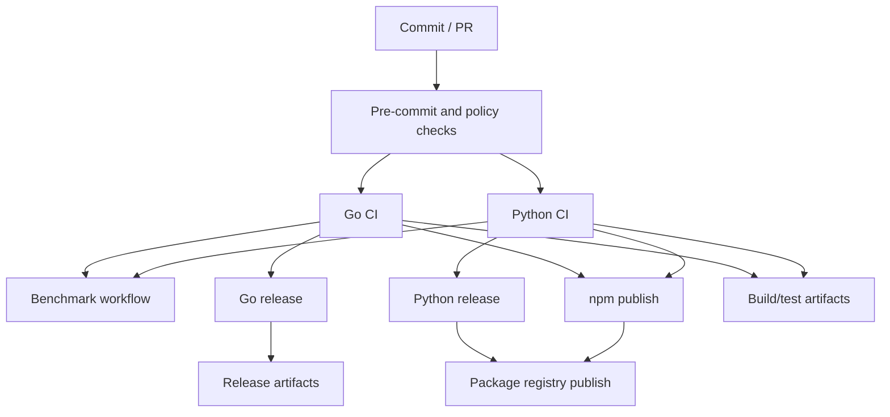

# Automation and Release Pipeline

## Overview

This repository uses a multi-language CI/CD setup centered on GitHub Actions workflows, with supporting local automation in shell scripts, Makefiles, and repository policy files. The pipeline is split across Go, Python, and npm packaging/release paths, plus a dedicated benchmark workflow and a few auxiliary automation assets. The most important workflow definitions are in [`.github/workflows/go-ci.yml`](.github/workflows/go-ci.yml), [`.github/workflows/python-ci.yml`](.github/workflows/python-ci.yml), [`.github/workflows/benchmark.yml`](.github/workflows/benchmark.yml), [`.github/workflows/go-release.yml`](.github/workflows/go-release.yml), [`.github/workflows/python-release.yml`](.github/workflows/python-release.yml), and [`.github/workflows/npm-publish.yml`](.github/workflows/npm-publish.yml).

A notable characteristic of this repository is that automation is not limited to “test and publish.” It also includes repository hygiene enforcement via [`.pre-commit-config.yaml`](.pre-commit-config.yaml), lint configuration in [`.eslintrc.json`](.eslintrc.json), [`.golangci.yml`](.golangci.yml), [`.prettierrc.json`](.prettierrc.json), [`.ruff_cache`](.ruff_cache/), and [`.editorconfig`](.editorconfig), and build/release composition in [`package.json`](package.json), [`pyproject.toml`](pyproject.toml), [`uv.lock`](uv.lock), and the Go module tree under [`go/`](go/).

The overall automation flow is:

1. validate code style and static checks,
2. run language-specific tests,
3. build artifacts and coverage reports,
4. optionally run benchmarks,
5. package and publish release artifacts for Go, Python, and npm consumers.

The repository also includes release metadata files such as [`CHANGELOG.md`](CHANGELOG.md) and [`RELEASE-NOTES.md`](RELEASE-NOTES.md), plus Go-specific release helper configuration in [`go/.goreleaser.yaml`](go/.goreleaser.yaml) and the root [`action.yml`](action.yml), which suggests the project may also be consumed as a reusable GitHub Action or automation component.

> **Sources:** `.github/workflows/go-ci.yml` · `.github/workflows/python-ci.yml` · `.github/workflows/benchmark.yml` · `.github/workflows/go-release.yml` · `.github/workflows/python-release.yml` · `.github/workflows/npm-publish.yml` · `.pre-commit-config.yaml` · `.eslintrc.json` · `.golangci.yml` · `.prettierrc.json` · `package.json` · `pyproject.toml` · `go/.goreleaser.yaml`

## Workflow Inventory

The table below maps each pipeline file to its trigger model, main jobs, and expected outputs. Where the analysis data does not expose exact job names or artifact names, the description stays at the observable level.

| Pipeline file | Trigger | Main jobs | Outputs |
|---|---|---|---|
| [`.github/workflows/go-ci.yml`](.github/workflows/go-ci.yml) | CI on Go-related changes / branch events (workflow file present, exact trigger not exposed) | Go build, Go lint/static analysis, Go test execution, likely coverage collection | Test results, lint status, build verification, possibly coverage artifacts |
| [`.github/workflows/python-ci.yml`](.github/workflows/python-ci.yml) | CI on Python-related changes / branch events (exact trigger not exposed) | Python dependency setup, linting, test orchestration | Test results, lint status, possibly coverage data |
| [`.github/workflows/benchmark.yml`](.github/workflows/benchmark.yml) | Benchmark-oriented trigger (exact event not exposed) | Benchmark job(s) around extraction performance/accuracy | Benchmark output files, performance metrics, comparison data |
| [`.github/workflows/go-release.yml`](.github/workflows/go-release.yml) | Release/tag-driven Go publish flow (exact trigger not exposed) | Build/package Go binaries, release publishing | Release binaries and release metadata |
| [`.github/workflows/python-release.yml`](.github/workflows/python-release.yml) | Release/tag-driven Python publish flow (exact trigger not exposed) | Build Python distribution artifacts, publish to package registry | Source/wheel distributions, publish logs |
| [`.github/workflows/npm-publish.yml`](.github/workflows/npm-publish.yml) | Publish flow for npm package updates (exact trigger not exposed) | npm package build/publish steps | npm package publication |
| [`action.yml`](action.yml) | GitHub Action metadata, consumed by Actions runner | Defines action entrypoints/inputs/outputs rather than a workflow | Action interface for downstream workflows |
| [`scripts/lint-and-report.sh`](scripts/lint-and-report.sh) | Helper script invoked from CI or local automation | Runs linting/report formatting pipeline steps | Lint report output |
| [`Makefile`](Makefile) | Local orchestration and CI helper entrypoint | Wrapper targets for build/test/lint/release tasks | Command abstraction for automation jobs |
| [`go/Makefile`](go/Makefile) | Go subproject helper automation | Go build/test/release helper targets | Go-side build and release convenience targets |
| [`go/.goreleaser.yaml`](go/.goreleaser.yaml) | Used by release automation | GoReleaser packaging configuration | Release archives/checksums/homebrew metadata if enabled |
| [`pipelines/harness-ci.yaml`](pipelines/harness-ci.yaml) | CI harness pipeline definition | Harness-based CI stages | Harness execution outputs |
| [`pipelines/harness-canary.yaml`](pipelines/harness-canary.yaml) | Canary pipeline definition | Canary validation stages | Canary validation outputs |
| [`pipelines/harness-feature-flag-gate.yaml`](pipelines/harness-feature-flag-gate.yaml) | Feature-flag gate pipeline | Gate/check stages | Promotion or gate decision outputs |

> **Sources:** `.github/workflows/go-ci.yml` · `.github/workflows/python-ci.yml` · `.github/workflows/benchmark.yml` · `.github/workflows/go-release.yml` · `.github/workflows/python-release.yml` · `.github/workflows/npm-publish.yml` · `action.yml` · `scripts/lint-and-report.sh` · `Makefile` · `go/Makefile` · `go/.goreleaser.yaml` · `pipelines/harness-ci.yaml` · `pipelines/harness-canary.yaml` · `pipelines/harness-feature-flag-gate.yaml`

## CI Workflow Breakdown

### Go CI

The Go CI workflow in [`.github/workflows/go-ci.yml`](.github/workflows/go-ci.yml) is the repository’s primary validation lane for the Go implementation under [`go/`](go/). From the file inventory, the Go codebase is substantial and includes command handlers in [`go/cmd/rekipedia/cmd/root.go`](go/cmd/rekipedia/cmd/root.go), core orchestration in [`go/internal/orchestrator/run_digest.go`](go/internal/orchestrator/run_digest.go) and [`go/internal/orchestrator/run_update.go`](go/internal/orchestrator/run_update.go), storage in [`go/internal/storage/store.go`](go/internal/storage/store.go), and extensive tests across `go/internal/*_test.go`.

The CI job set is expected to cover:
- Go compilation/build verification,
- `go test` across the internal packages and command packages,
- static linting (very likely via [`golangci-lint`](.golangci.yml)),
- possibly artifact/coverage generation.

The Go test surface is broad, including storage, extractor, orchestrator, server, and synthesis components. That makes this workflow the key gate for regressions in both business logic and release packaging code.

### Python CI

The Python CI workflow in [`.github/workflows/python-ci.yml`](.github/workflows/python-ci.yml) validates the Python implementation under [`src/rekipedia/`](src/rekipedia/). This layer includes the CLI entrypoint in [`src/rekipedia/__main__.py`](src/rekipedia/__main__.py), orchestration in [`src/rekipedia/orchestrator/run_digest.py`](src/rekipedia/orchestrator/run_digest.py) and [`src/rekipedia/orchestrator/run_update.py`](src/rekipedia/orchestrator/run_update.py), storage in [`src/rekipedia/storage/sqlite_store.py`](src/rekipedia/storage/sqlite_store.py), and synthesis/export paths such as [`src/rekipedia/synthesis/page_builder.py`](src/rekipedia/synthesis/page_builder.py).

The observable automation support strongly suggests that Python CI performs:
- dependency installation from [`pyproject.toml`](pyproject.toml) and [`uv.lock`](uv.lock),
- linting/format enforcement using [`ruff`](.ruff_cache/) and project style settings,
- test orchestration across the `tests/` suite,
- possibly packaging checks to ensure release builds remain valid.

### Benchmark Workflow

The benchmark workflow in [`.github/workflows/benchmark.yml`](.github/workflows/benchmark.yml) is specifically concerned with performance and quality measurement rather than pass/fail validation alone. The repository includes a dedicated benchmark harness in [`benchmarks/run_extraction.py`](benchmarks/run_extraction.py), with fixtures for Python and TypeScript extraction in [`benchmarks/fixtures/python_web_app/app.py`](benchmarks/fixtures/python_web_app/app.py) and [`benchmarks/fixtures/typescript_react/App.tsx`](benchmarks/fixtures/typescript_react/App.tsx).

This workflow likely drives:
- extraction accuracy benchmark runs,
- performance timing comparisons,
- output JSON or report generation for regression tracking.

### Harness Pipelines

The `pipelines/*.yaml` files indicate an additional automation plane, likely used by an external harness or progressive delivery framework. The names alone reveal intended roles:
- [`pipelines/harness-ci.yaml`](pipelines/harness-ci.yaml) for mainline validation,
- [`pipelines/harness-canary.yaml`](pipelines/harness-canary.yaml) for small-scope verification,
- [`pipelines/harness-feature-flag-gate.yaml`](pipelines/harness-feature-flag-gate.yaml) for deployment gating.

Because the file contents are not analyzed here, the documentation can only assert the existence of these pipeline definitions and their role names, not their exact job graphs.

> **Sources:** `.github/workflows/go-ci.yml` · `.github/workflows/python-ci.yml` · `.github/workflows/benchmark.yml` · `benchmarks/run_extraction.py` · `benchmarks/fixtures/python_web_app/app.py` · `benchmarks/fixtures/typescript_react/App.tsx` · `src/rekipedia/__main__.py` · `src/rekipedia/orchestrator/run_digest.py` · `src/rekipedia/orchestrator/run_update.py` · `src/rekipedia/storage/sqlite_store.py` · `src/rekipedia/synthesis/page_builder.py` · `pipelines/harness-ci.yaml` · `pipelines/harness-canary.yaml` · `pipelines/harness-feature-flag-gate.yaml`

## Release and Publishing Pipeline

### Go Release

The Go release path is represented by [`.github/workflows/go-release.yml`](.github/workflows/go-release.yml) and [`go/.goreleaser.yaml`](go/.goreleaser.yaml). The presence of a GoReleaser config strongly indicates that release automation packages compiled Go binaries and associated artifacts in a standardized way.

From the repository layout, the likely outputs are:
- release binaries for `rekipedia`,
- checksums and release metadata,
- possibly Homebrew formula or tap updates, supported by [`/.github/scripts/update-homebrew-tap.py`](.github/scripts/update-homebrew-tap.py).

The Go project also includes release-specific top-level files such as [`go/RELEASE-NOTES.md`](go/RELEASE-NOTES.md) and [`RELEASE-NOTES.md`](RELEASE-NOTES.md), which suggests release notes are curated outside the workflow and consumed by publication jobs.

### Python Release

The Python release pipeline in [`.github/workflows/python-release.yml`](.github/workflows/python-release.yml) packages the Python distribution from [`pyproject.toml`](pyproject.toml). The repo’s structure supports a standard package build/publish flow:
- project metadata in [`pyproject.toml`](pyproject.toml),
- lockfile pinning in [`uv.lock`](uv.lock),
- source code under [`src/rekipedia/`](src/rekipedia/),
- tests under [`tests/`](tests/).

The likely outputs are source distributions and wheels published to a package registry. Exact registry targets are not exposed in the analysis data.

### npm Publish

The npm publish flow in [`.github/workflows/npm-publish.yml`](.github/workflows/npm-publish.yml) aligns with the presence of [`package.json`](package.json), [`bin/rekipedia.js`](bin/rekipedia.js), and the action metadata file [`action.yml`](action.yml). This indicates that the repository may publish a JavaScript/npm-facing wrapper or executable package alongside the Go/Python implementations.

At a high level, this workflow likely:
- installs JavaScript dependencies,
- runs package validation and linting,
- publishes the package to npm on a tagged or manually approved release event.

### Related Release Assets

Several files support the release pipeline indirectly:
- [`CHANGELOG.md`](CHANGELOG.md) and [`RELEASE-NOTES.md`](RELEASE-NOTES.md) for human-readable release history,
- [`CONTRIBUTING.md`](CONTRIBUTING.md) and [`CLAUDE.md`](CLAUDE.md) for contributor/release conventions,
- [`action.yml`](action.yml) for GitHub Action consumption,
- [`Dockerfile.sandbox`](Dockerfile.sandbox) and [`go/Dockerfile`](go/Dockerfile) for containerized runtime or release images.

> **Sources:** `.github/workflows/go-release.yml` · `.github/workflows/python-release.yml` · `.github/workflows/npm-publish.yml` · `go/.goreleaser.yaml` · `go/RELEASE-NOTES.md` · `RELEASE-NOTES.md` · `.github/scripts/update-homebrew-tap.py` · `pyproject.toml` · `uv.lock` · `package.json` · `bin/rekipedia.js` · `action.yml` · `Dockerfile.sandbox` · `go/Dockerfile`

## Linting, Formatting, and Policy Enforcement

The repository has a layered linting strategy that combines formatter configs, language-specific linters, and pre-commit enforcement.

### Format and Style Configuration

- [`.editorconfig`](.editorconfig) defines cross-editor whitespace and line-ending conventions.
- [`.prettierrc.json`](.prettierrc.json) standardizes JavaScript/JSON formatting.
- [`.eslintrc.json`](.eslintrc.json) configures JavaScript/TypeScript lint checks.
- [`.golangci.yml`](.golangci.yml) defines Go linting rules.
- [`.pre-commit-config.yaml`](.pre-commit-config.yaml) indicates that local commits are probably validated before CI even runs.

### Lint Reporting

The helper script [`scripts/lint-and-report.sh`](scripts/lint-and-report.sh) implies a wrapper around lint execution and report generation. The presence of repository instructions such as [`.github/lint-report.instructions.md`](.github/lint-report.instructions.md) and [`skills/shared/lint-report-prompt.md`](skills/shared/lint-report-prompt.md) suggests lint output may be summarized into reviewer-friendly reports.

### Repository Policy

The `.github` instruction files, including [`.github/husky-enforcement.instructions.md`](.github/husky-enforcement.instructions.md) and [`.github/copilot-instructions.md`](.github/copilot-instructions.md), indicate that automation also includes policy enforcement and coding guidance.

| Concern | Config / Script | Expected role in CI |
|---|---|---|
| Formatting | `.prettierrc.json`, `.editorconfig` | Normalize formatting and whitespace |
| JavaScript linting | `.eslintrc.json` | Validate JS/TS code quality |
| Go linting | `.golangci.yml` | Static analysis for Go packages |
| Commit hooks | `.pre-commit-config.yaml` | Preflight checks before merge |
| Lint reporting | `scripts/lint-and-report.sh` | Aggregate and format lint results |

> **Sources:** `.editorconfig` · `.prettierrc.json` · `.eslintrc.json` · `.golangci.yml` · `.pre-commit-config.yaml` · `scripts/lint-and-report.sh` · `.github/lint-report.instructions.md` · `.github/husky-enforcement.instructions.md` · `skills/shared/lint-report-prompt.md`

## Test Orchestration

Test orchestration is split by language and package family.

### Go Test Matrix

The Go codebase has a large test suite with coverage across:
- command registration and CLI behavior in [`go/cmd/rekipedia/cmd/root_test.go`](go/cmd/rekipedia/cmd/root_test.go) and related command tests,
- extractor behavior in [`go/internal/extractor/extractor_test.go`](go/internal/extractor/extractor_test.go),
- orchestrator behavior in [`go/internal/orchestrator/orchestrator_test.go`](go/internal/orchestrator/orchestrator_test.go),
- storage persistence in [`go/internal/storage/store_test.go`](go/internal/storage/store_test.go),
- server HTTP behavior in [`go/internal/server/server_test.go`](go/internal/server/server_test.go),
- synthesis/export correctness in [`go/internal/synthesis/synthesis_test.go`](go/internal/synthesis/synthesis_test.go) and related exporter tests.

That broad spread means CI is not just running one “go test” bucket; it is validating multiple functional slices of the application.

### Python Test Suite

The Python side is backed by a rich `tests/` directory covering analysis, CLI, extraction, storage, server, synthesis, watchers, and RAG behavior. Representative examples include:
- [`tests/test_page_builder.py`](tests/test_page_builder.py),
- [`tests/test_sqlite_store.py`](tests/test_sqlite_store.py),
- [`tests/test_server.py`](tests/test_server.py),
- [`tests/test_watcher.py`](tests/test_watcher.py),
- [`tests/test_vector_store.py`](tests/test_vector_store.py).

This suggests the Python CI workflow likely runs a test suite that exercises package behavior end to end, with fixtures in [`tests/fixtures/mini-py-repo/`](tests/fixtures/mini-py-repo/) and [`tests/fixtures/mini-ts-repo/`](tests/fixtures/mini-ts-repo/).

### Benchmark Tests as Quality Gates

Although the benchmark harness is separate from standard tests, it still acts as an automation gate because it measures extraction accuracy and performance on curated fixtures in [`benchmarks/fixtures/`](benchmarks/fixtures/). The benchmark job therefore complements the unit/integration test suite by catching regressions in practical throughput or output quality.

> **Sources:** `go/cmd/rekipedia/cmd/root_test.go` · `go/internal/extractor/extractor_test.go` · `go/internal/orchestrator/orchestrator_test.go` · `go/internal/storage/store_test.go` · `go/internal/server/server_test.go` · `go/internal/synthesis/synthesis_test.go` · `tests/test_page_builder.py` · `tests/test_sqlite_store.py` · `tests/test_server.py` · `tests/test_watcher.py` · `tests/test_vector_store.py` · `benchmarks/fixtures/python_web_app/app.py` · `benchmarks/fixtures/typescript_react/App.tsx`

## Workflow Stage Diagram

This diagram is intentionally high level: it reflects the observable automation structure in the repository, not an inferred job-by-job implementation of each workflow.

> **Sources:** `.github/workflows/go-ci.yml` · `.github/workflows/python-ci.yml` · `.github/workflows/benchmark.yml` · `.github/workflows/go-release.yml` · `.github/workflows/python-release.yml` · `.github/workflows/npm-publish.yml` · `.pre-commit-config.yaml`

## Automation Notes and Observability Gaps

The repository snapshot exposes the existence of the main pipeline files, but not the detailed job definitions inside each workflow. As a result, this page focuses on what is clearly evidenced:
- which workflows exist,
- which language/tooling domains they serve,
- which build/test/release steps are likely present from the surrounding configuration,
- and how the automation is organized at a system level.

If you need exact job names, step order, artifact names, or branch/tag filters, those must be read directly from the workflow YAML files themselves. The current analysis data does not include their contents.

> **Sources:** `.github/workflows/go-ci.yml` · `.github/workflows/python-ci.yml` · `.github/workflows/benchmark.yml` · `.github/workflows/go-release.yml` · `.github/workflows/python-release.yml` · `.github/workflows/npm-publish.yml`