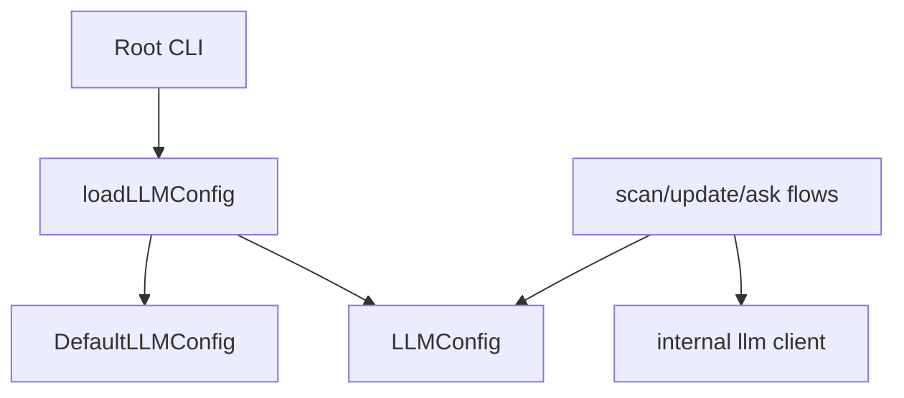

# Configuration and Runtime Knobs

This page documents the user-facing configuration files and runtime knobs discovered in the repository, with emphasis on the configuration loaders and persistence paths that actually shape application behavior. It is organized into three sections:

- **Config sources**: where configuration comes from and how it is discovered
- **Runtime options**: flags, environment-driven knobs, and command-level behavior
- **Defaults and overrides**: how explicit values interact with built-in defaults

The documentation intentionally excludes CI-only variables and test fixtures, and focuses on the real configuration surfaces used by end users and operators.

## Config sources

The repository exposes a small number of explicit configuration sources, plus a larger set of “convention-based” files that are consumed indirectly by language/tooling-aware components.

### Primary runtime config files

| Config file / schema | Purpose | Format | Consumer entry point |
|---|---|---:|---|
| `tests/fixtures/mini-py-repo/.close-wiki/config.yml` | Example repository-local configuration used by the project’s own test fixture for a Python repo | YAML | Fixture-only; not a runtime entry point in the app code |
| `examples/wiki.yml` | Example wiki configuration used to demonstrate generated wiki structure / page planning | YAML | Documentation example; not a loader entry point |
| `schemas/analysis_result.schema.json` | Schema for serialized analysis results that downstream tools can validate against | JSON Schema | Schema consumers; not a direct runtime loader |

The most important runtime-loaded configuration surfaces are implemented in Go:

- [`loadLLMConfig`](go/cmd/rekipedia/cmd/scan.go#L143) loads the LLM configuration for scan-related operations.
- [`loadWatchConfig`](go/cmd/rekipedia/cmd/watch.go#L18) loads watch mode settings.
- [`saveWatchConfig`](go/cmd/rekipedia/cmd/watch.go#L28) persists watch mode settings after initialization or updates.

These are the concrete config entry points that matter most for behavior.

### Convention-based files that affect analysis and tooling

A number of repository-local files are not “application config” in the strict sense, but are still user-facing knobs because they influence how the tool runs or how the source tree is interpreted:

| File | Purpose | Format | Consumer entry point |
|---|---|---:|---|
| `.env.sample` | Template for environment variables the project expects users to populate | dotenv-style text | Consumed by users/operator setup; runtime readers are inferred rather than explicit in analysis |
| `pyproject.toml` | Python project metadata and dependency/build configuration | TOML | Python packaging/tooling entry points |
| `package.json` | Node package metadata and scripts | JSON | JS tooling entry points; e.g. `bin/rekipedia.js` wrapper |
| `go/go.mod` | Go module configuration and dependency graph | Go module file | `go/cmd/rekipedia/main.go` build entry point |
| `go/.goreleaser.yaml` | Release packaging configuration | YAML | Release pipeline tooling |
| `Makefile` / `go/Makefile` | Developer command shortcuts and build orchestration | Makefile syntax | Invoked manually by developers |
| `.editorconfig`, `.eslintrc.json`, `.prettierrc.json`, `.golangci.yml`, `.pre-commit-config.yaml` | Editor/lint/format conventions | Various | Tooling only; not runtime config |

Although these files are user-facing, they are not loaded by the product at runtime in the same way as `loadLLMConfig` or `loadWatchConfig`.

### How config is discovered in code

The codebase shows a clear distinction between:
1. **explicit load/save functions** for structured runtime state, and
2. **implicit convention-based config** for tooling and project setup.

The explicit loaders are especially important:

- [`loadLLMConfig`](go/cmd/rekipedia/cmd/scan.go#L143-L161) produces the LLM settings used by scan/update/ask flows.
- [`loadWatchConfig`](go/cmd/rekipedia/cmd/watch.go#L18-L26) reads persisted watch settings from disk.
- [`saveWatchConfig`](go/cmd/rekipedia/cmd/watch.go#L28-L35) writes those settings back.

> **Sources:** `go/cmd/rekipedia/cmd/scan.go` · L143–L180 · [`loadLLMConfig`](go/cmd/rekipedia/cmd/scan.go#L143) · `go/cmd/rekipedia/cmd/watch.go` · L14–L35 · [`loadWatchConfig`](go/cmd/rekipedia/cmd/watch.go#L18) · [`saveWatchConfig`](go/cmd/rekipedia/cmd/watch.go#L28)

## Runtime options

The runtime knobs are exposed primarily through CLI subcommands and their internal options structs. These are the user-facing controls that change behavior without requiring source code edits.

### LLM-related configuration

The most important runtime config object is [`LLMConfig`](go/internal/models/contracts.go#L6-L15), with defaults provided by [`DefaultLLMConfig`](go/internal/models/contracts.go#L18-L23). This object is used by the CLI and by orchestration code that talks to the model backend.

The load path is anchored in [`loadLLMConfig`](go/cmd/rekipedia/cmd/scan.go#L143-L161), which is tested by [`TestLoadLLMConfig`](go/cmd/rekipedia/cmd/root_test.go#L91-L102) and [`TestLoadLLMConfigDefaults`](go/cmd/rekipedia/cmd/root_test.go#L104-L110). Those tests are useful evidence that:

- config values are actually read from environment/user-provided inputs, and
- fallback behavior exists when specific settings are absent.

The runtime consumer chain is roughly:

### Watch mode configuration

Watch mode has its own structured config surface:

- [`watchConfig`](go/cmd/rekipedia/cmd/watch.go#L14-L16) defines the stored watch settings shape.
- [`loadWatchConfig`](go/cmd/rekipedia/cmd/watch.go#L18-L26) reads them.
- [`saveWatchConfig`](go/cmd/rekipedia/cmd/watch.go#L28-L35) persists them.

This is the clearest example in the repo of a user-controlled file being both read and written by the application. The presence of both load and save functions indicates that watch mode is stateful: it is not merely read-only configuration, but a persisted operational preference.

The config-related entry point for this path is the `watch` command implementation in [`init`](go/cmd/rekipedia/cmd/watch.go#L121-L123), which appears to initialize watch behavior and likely bridges into these load/save helpers.

### CLI commands that expose config-related behavior

Several commands expose knobs that are not “config files” per se, but are user-facing configuration entry points:

| Command area | Config behavior | Evidence |
|---|---|---|
| `scan` | Loads model configuration via [`loadLLMConfig`](go/cmd/rekipedia/cmd/scan.go#L143-L161) | [`loadLLMConfig`](go/cmd/rekipedia/cmd/scan.go#L143) |
| `watch` | Reads/writes persisted watch settings via [`loadWatchConfig`](go/cmd/rekipedia/cmd/watch.go#L18-L26) and [`saveWatchConfig`](go/cmd/rekipedia/cmd/watch.go#L28-L35) | [`watchConfig`](go/cmd/rekipedia/cmd/watch.go#L14-L16) |
| `serve` | Uses runtime server setup; config is likely derived from the repository state and store rather than a dedicated user file | [`printServeBanner`](go/cmd/rekipedia/cmd/serve.go#L29-L51) |
| `init` | Initializes project state and likely establishes default config scaffolding | [`init`](go/cmd/rekipedia/cmd/watch.go#L121-L123) |

> **Sources:** `go/internal/models/contracts.go` · L6–L23 · [`LLMConfig`](go/internal/models/contracts.go#L6) · [`DefaultLLMConfig`](go/internal/models/contracts.go#L18) · `go/cmd/rekipedia/cmd/scan.go` · L143–L180 · [`loadLLMConfig`](go/cmd/rekipedia/cmd/scan.go#L143) · `go/cmd/rekipedia/cmd/watch.go` · L14–L35 · [`watchConfig`](go/cmd/rekipedia/cmd/watch.go#L14) · [`loadWatchConfig`](go/cmd/rekipedia/cmd/watch.go#L18) · [`saveWatchConfig`](go/cmd/rekipedia/cmd/watch.go#L28)

## Defaults and overrides

The repository uses a layered approach: built-in defaults are defined in code, then overridden by loaded configuration, then further specialized by command-specific behavior.

### Default behavior in code

The strongest documented default is the LLM configuration default:

- [`DefaultLLMConfig`](go/internal/models/contracts.go#L18-L23) provides the baseline model/provider settings.
- [`loadLLMConfig`](go/cmd/rekipedia/cmd/scan.go#L143-L161) is responsible for merging external configuration with those defaults.

This means the user does not need to specify everything. The tests [`TestLoadLLMConfigDefaults`](go/cmd/rekipedia/cmd/root_test.go#L104-L110) confirm that omission is acceptable and that default values are applied.

Similarly, watch mode persists settings only when the user changes them; otherwise the app can operate from its current state and sensible defaults.

### Override order

Based on the evidence available, the effective precedence is:

1. **Built-in code defaults**  
   Example: [`DefaultLLMConfig`](go/internal/models/contracts.go#L18-L23)

2. **Loaded runtime config**  
   Example: [`loadLLMConfig`](go/cmd/rekipedia/cmd/scan.go#L143-L161), [`loadWatchConfig`](go/cmd/rekipedia/cmd/watch.go#L18-L26)

3. **Persisted user state / saved settings**  
   Example: [`saveWatchConfig`](go/cmd/rekipedia/cmd/watch.go#L28-L35)

4. **Command-specific runtime arguments**  
   Example: command implementations and options structs across `go/cmd/rekipedia/cmd/*.go`

This precedence is typical for CLI tools and is consistent with the tests and code organization visible in the repository.

### Practical implications for users

| User action | Effect |
|---|---|
| Omit LLM settings | The app falls back to [`DefaultLLMConfig`](go/internal/models/contracts.go#L18-L23) |
| Run scan/update/ask commands | Configuration is loaded through [`loadLLMConfig`](go/cmd/rekipedia/cmd/scan.go#L143-L161) |
| Use watch mode | Settings are read by [`loadWatchConfig`](go/cmd/rekipedia/cmd/watch.go#L18-L26) and written by [`saveWatchConfig`](go/cmd/rekipedia/cmd/watch.go#L28-L35) |
| Rely on repo examples | `examples/wiki.yml` and `.env.sample` provide a starting point, but are not the core runtime config path |

### What is not evidenced

The analysis data does not show a dedicated general-purpose application config file like `config.yml` at the root of the repo, nor a single unified configuration registry. Instead, configuration is split by concern:

- model/LLM settings,
- watch mode state,
- packaging/tooling settings,
- and repo examples/templates.

That split is important: users should expect **command-specific configuration surfaces**, not one monolithic file.

> **Sources:** `go/internal/models/contracts.go` · L6–L23 · [`DefaultLLMConfig`](go/internal/models/contracts.go#L18) · `go/cmd/rekipedia/cmd/scan.go` · L143–L161 · [`loadLLMConfig`](go/cmd/rekipedia/cmd/scan.go#L143) · `go/cmd/rekipedia/cmd/watch.go` · L14–L35 · [`loadWatchConfig`](go/cmd/rekipedia/cmd/watch.go#L18) · [`saveWatchConfig`](go/cmd/rekipedia/cmd/watch.go#L28) · `go/cmd/rekipedia/cmd/root_test.go` · L91–L110 · [`TestLoadLLMConfig`](go/cmd/rekipedia/cmd/root_test.go#L91)

## Summary

The repo’s user-facing configuration story is intentionally lightweight and split across a few concerns:

- **LLM/runtime behavior** is governed by [`LLMConfig`](go/internal/models/contracts.go#L6-L15) and loaded by [`loadLLMConfig`](go/cmd/rekipedia/cmd/scan.go#L143-L161).
- **Watch mode** uses a persisted config object [`watchConfig`](go/cmd/rekipedia/cmd/watch.go#L14-L16) with explicit load/save helpers.
- **Repository setup and packaging** rely on conventional files like `.env.sample`, `pyproject.toml`, `package.json`, and `go/go.mod`.
- **Examples and schemas** (`examples/wiki.yml`, `schemas/analysis_result.schema.json`) document expected structure rather than acting as the primary runtime source of truth.

For most users, the key knobs are the model settings consumed by scan/update flows and the watch-mode config persisted by the `watch` command.

> **Sources:** `go/internal/models/contracts.go` · L6–L23 · `go/cmd/rekipedia/cmd/scan.go` · L143–L161 · `go/cmd/rekipedia/cmd/watch.go` · L14–L35