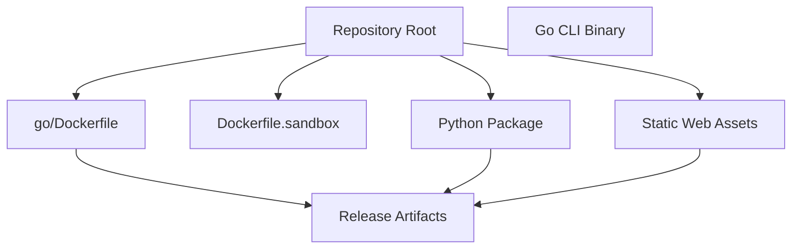
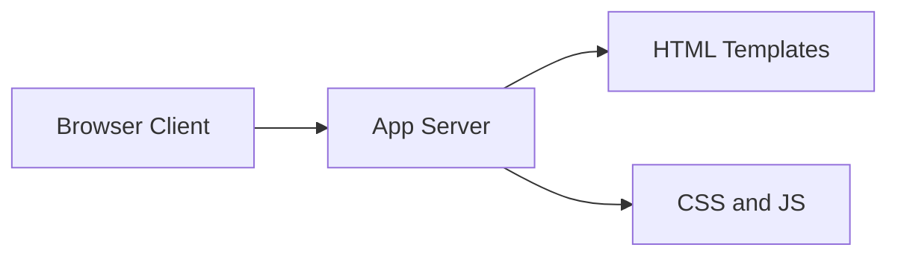

# Deployment and Packaging Overview

## What This Repository Ships

This repository is clearly multi-ecosystem and supports more than one packaging/deployment path. The build commands show three primary distribution targets: a Python package built with `uv build` / `hatch build`, a Go CLI binary built with `CGO_ENABLED=0 go build -ldflags "-s -w" -o /tmp/reki ./cmd/rekipedia`, and a container image built with `docker build .`. There is also a frontend/web asset build step via `npm run build  # tsc`, which implies a compiled JavaScript/TypeScript artifact for the web interface or Node-facing package entrypoint. The layout reinforces this split: `src/rekipedia/` is the Python package tree, `go/` contains the Go implementation and its release tooling, `bin/rekipedia.js` is a Node launcher, and `go/internal/server/templates/` plus `src/rekipedia/server/static/` hold web assets served at runtime.

The repo therefore supports both source distribution and compiled delivery. In practice, it appears designed so that:
- Python users install a package from the `src/rekipedia` tree.
- Go users consume a standalone CLI binary.
- Container users run a sandbox or service image.
- Web UI assets are bundled into the application and served by the Go or Python server layers.

> **Sources:** `pyproject.toml` · `package.json` · `go/go.mod` · `go/Dockerfile` · `Dockerfile.sandbox` · `bin/rekipedia.js`

## Packaging Targets by Ecosystem

| Deployment target | Artifact(s) | Build input / command evidence | Runtime assumptions |
|---|---|---|---|
| Python package | `rekipedia` package from `src/rekipedia/` | `uv build`, `hatch build` | Python runtime, package-installable `src` layout |
| Go CLI binary | Standalone executable (`rekipedia`) | `CGO_ENABLED=0 go build -ldflags "-s -w" -o /tmp/reki ./cmd/rekipedia` | Static-ish Linux/macOS-style binary, no CGO dependency |
| Docker image | Container image built from repo root / `go/Dockerfile` | `docker build .` | Container runtime, filesystem writes for state/storage |
| Web assets | Static templates and JS/CSS assets | `npm run build  # tsc`, plus `src/rekipedia/server/static/*`, `go/internal/server/templates/*` | Browser-capable runtime, server can serve static files |
| Node launcher | `bin/rekipedia.js` wrapper | Presence of `bin/rekipedia.js` and `package.json` | Node.js environment for CLI shim or cross-platform entrypoint |

> **Sources:** `package.json` · `pyproject.toml` · `bin/rekipedia.js` · `src/rekipedia/server/static/reki.css` · `src/rekipedia/server/static/reki.js` · `go/internal/server/templates/base.html` · `go/internal/server/templates/index.html`

## Go Binary Packaging

The Go side is the most explicit “ship a compiled executable” path. The build command `CGO_ENABLED=0 go build -ldflags "-s -w" -o /tmp/reki ./cmd/rekipedia` indicates a release-oriented build that disables CGO and strips debug symbols. That usually implies:
- no runtime dependency on a C toolchain or system libraries,
- a portable binary suitable for direct download,
- a reduced binary size because of `-s -w`.

The main entrypoint is [`main`](go/cmd/rekipedia/main.go#L6) in `go/cmd/rekipedia/main.go`, which delegates to the CLI command tree defined under `go/cmd/rekipedia/cmd/`. The Go release setup is also supported by `go/.goreleaser.yaml`, suggesting that formal release artifacts are produced for tagged versions. The repo includes `go/install.sh`, which usually points to a curl/install-style distribution path for end users who want the compiled CLI without building from source.

Because CGO is disabled in the build command, deployment should assume:
- a pure-Go build environment,
- no native database/client libraries required at link time,
- runtime filesystem access for persistence and configuration.

> **Sources:** `go/cmd/rekipedia/main.go` · `go/.goreleaser.yaml` · `go/install.sh` · `go/go.mod`

## Containerization

Container deployment is explicitly supported by both `Dockerfile.sandbox` and `go/Dockerfile`. The existence of a sandbox-specific Dockerfile implies a separate execution environment for isolated or untrusted tasks, while the Go Dockerfile suggests packaging the CLI or service into a runnable image. The repo root also includes `docker build .` in the documented build commands, which means the top-level build context is intended to produce a usable container image.

The runtime model implied by the codebase is stateful rather than stateless:
- the server layer uses a local store backed by SQLite-like migrations in `src/rekipedia/storage/migrations/`,
- the application has QA/history/page persistence in `src/rekipedia/storage/sqlite_store.py`,
- sandbox execution exists under `src/rekipedia/sandbox/runner.py`.

This means container deployments likely need mounted volumes for persistence if data must survive container restarts. The code layout also suggests that the image may need access to the repository workspace itself, especially for scanning, serving generated pages, or building wiki outputs.

> **Sources:** `Dockerfile.sandbox` · `go/Dockerfile` · `src/rekipedia/storage/migrations/001_initial.sql` · `src/rekipedia/storage/sqlite_store.py` · `src/rekipedia/sandbox/runner.py`

## Python Packaging

The Python packaging story is rooted in the `src/rekipedia/` layout and the presence of `pyproject.toml` and `uv.lock`. The build commands include both `uv build` and `hatch build`, which strongly suggests the project can be packaged as a standard Python distribution artifact, likely a wheel and source tarball. The `src` layout indicates an installable package rather than a script-only repo.

The runtime entrypoint is [`__main__`](src/rekipedia/__main__.py) alongside [`__init__`](src/rekipedia/__init__.py), which means the package is intended to be runnable as a module. This is consistent with the rest of the Python tree: CLI modules live under `src/rekipedia/cli/`, server code under `src/rekipedia/server/`, and persistence under `src/rekipedia/storage/`. That layout implies a package installation model where the wheel contains both application logic and bundled static/templates content.

The package appears to rely on:
- Python 3 runtime support,
- local filesystem access for workspace scanning and persisted storage,
- bundled HTML templates and static assets for the web server.

> **Sources:** `pyproject.toml` · `uv.lock` · `src/rekipedia/__main__.py` · `src/rekipedia/__init__.py` · `src/rekipedia/server/app.py`

## Web Assets and Server-Side Bundling

The repository includes both server-rendered templates and static browser assets. On the Go side, templates are in `go/internal/server/templates/` and include `ask.html`, `base.html`, `graph.html`, `index.html`, and `wiki.html`. On the Python side, the same general structure exists in `src/rekipedia/server/templates/` and `src/rekipedia/server/static/`, with `reki.css` and `reki.js` providing browser behavior and styling.

This means deployment should assume that a build or package step must preserve these files alongside the code, because they are runtime dependencies rather than development-only resources. The server implementation is expected to serve them from the filesystem or package resources, so a container or wheel must keep them accessible.

> **Sources:** `go/internal/server/templates/base.html` · `go/internal/server/templates/index.html` · `go/internal/server/templates/wiki.html` · `src/rekipedia/server/templates/base.html` · `src/rekipedia/server/static/reki.css` · `src/rekipedia/server/static/reki.js`

## Runtime Assumptions and Deployment Constraints

The repository layout and build commands imply several concrete runtime assumptions:

| Assumption | Evidence | Deployment implication |
|---|---|---|
| Local persistent storage is required | `src/rekipedia/storage/sqlite_store.py`, `go/internal/storage/store.go`, migrations under `src/rekipedia/storage/migrations/` | Containers should mount writable volumes |
| The app can run as a CLI or server | `go/cmd/rekipedia/cmd/serve.go`, `src/rekipedia/cli/serve.py` | Releases may need both headless and service modes |
| Web assets are part of the runtime package | `src/rekipedia/server/static/`, `go/internal/server/templates/` | Packaging must include non-code files |
| Workspace files are analyzed at runtime | `go/internal/orchestrator/snapshotter.go`, `src/rekipedia/orchestrator/snapshotter.py` | Deployment needs access to target repos or mounted source trees |
| No CGO dependency for Go release builds | `CGO_ENABLED=0 go build ...` | Simplifies container and binary portability |

The repository also includes `action.yml` and GitHub release workflows (`.github/workflows/go-release.yml`, `.github/workflows/python-release.yml`, `.github/workflows/npm-publish.yml`), which indicates automated publishing to ecosystem-specific registries or release channels. Those workflows reinforce the idea that the project is distributed through multiple artifact pipelines rather than a single monolithic installer.

> **Sources:** `go/internal/storage/store.go` · `src/rekipedia/storage/sqlite_store.py` · `src/rekipedia/storage/migrations/001_initial.sql` · `go/internal/orchestrator/snapshotter.go` · `src/rekipedia/orchestrator/snapshotter.py` · `.github/workflows/go-release.yml` · `.github/workflows/python-release.yml` · `.github/workflows/npm-publish.yml` · `action.yml`

## Deployment Summary

Overall, the project is packaged as a multi-artifact ecosystem:

- **Go**: a released CLI binary, likely the most direct end-user deployment target.
- **Python**: installable package artifacts produced from `pyproject.toml`.
- **Docker**: container images for reproducible runtime and sandbox execution.
- **Web assets**: bundled templates and static resources required by the server UI.
- **Node**: a JavaScript launcher/wrapper used as an entrypoint or integration shim.

The build commands and directory structure are consistent with a deployment model where source, binary, and container distributions are all first-class. Any production deployment should plan for persisted state, workspace access, and bundled UI files, regardless of which ecosystem-specific artifact is chosen.

> **Sources:** `package.json` · `pyproject.toml` · `go/.goreleaser.yaml` · `go/Dockerfile` · `Dockerfile.sandbox` · `bin/rekipedia.js`