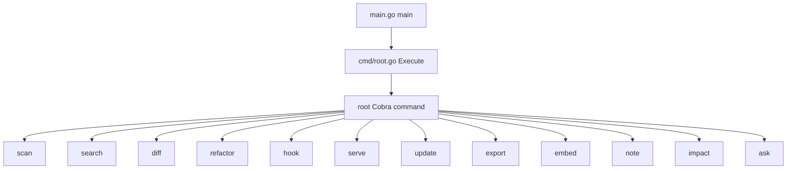
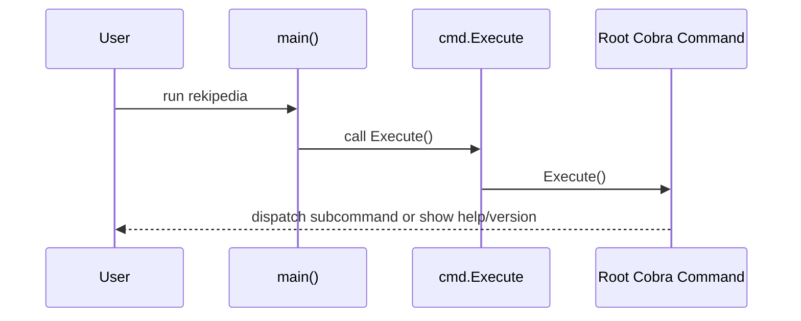
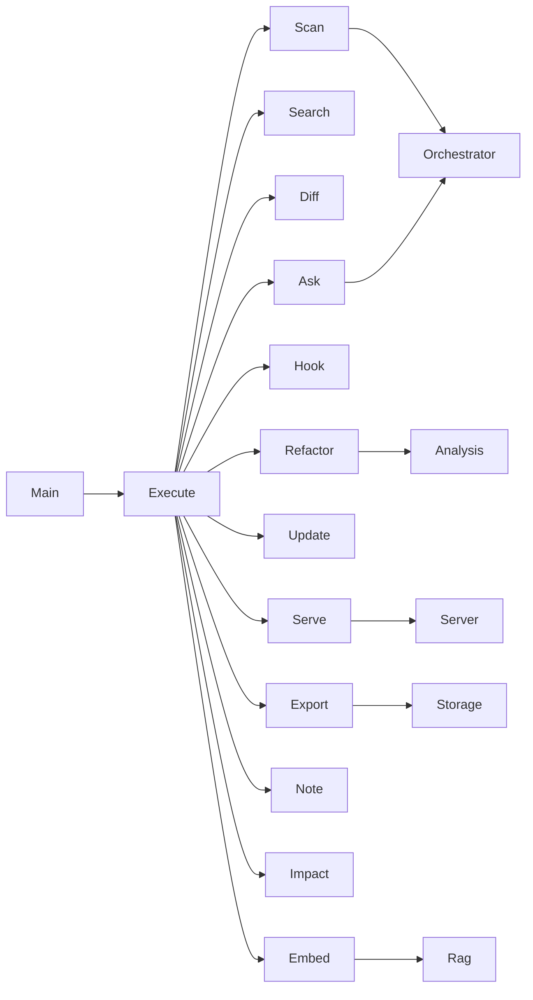

# Rekipedia Go CLI Command Reference

## Subcommand Tree

The Go CLI lives under `go/cmd/rekipedia` and is rooted in [`Execute`](go/cmd/rekipedia/cmd/root.go#L44), which wires the Cobra command tree together and is invoked by [`main`](go/cmd/rekipedia/main.go#L6) through the package entry point [`main()`](go/cmd/rekipedia/main.go#L6). The command hierarchy is composed by `init` functions spread across the command files, which register subcommands like `scan`, `search`, `diff`, `refactor`, `hook`, `serve`, `update`, `export`, `embed`, `note`, `impact`, and `ask` onto the root command in [`root.go`](go/cmd/rekipedia/cmd/root.go#L50-L78).

At a high level, the CLI groups fall into three functional areas:

- **Indexing and analysis**: `scan`, `refactor`, `impact`, `search`, `diff`
- **Persistence and lifecycle**: `update`, `export`, `embed`, `note`, `hook`
- **Interactive and web UX**: `ask`, `serve`

The tree is intentionally Cobra-based, so most behavior is attached via `init` registration rather than a single monolithic dispatcher. That makes each command independently testable and easier to extend.  
> **Sources:** `go/cmd/rekipedia/main.go` · L6–L8 · [`main`](go/cmd/rekipedia/main.go#L6) · `go/cmd/rekipedia/cmd/root.go` · L44–L78 · [`Execute`](go/cmd/rekipedia/cmd/root.go#L44)

## Command Groups Overview

The following table summarizes the visible subcommands in this Go CLI, based on the registered command files under `go/cmd/rekipedia/cmd`. Where the analysis exposed implementation symbols, those are linked directly.

| Subcommand | Purpose | Primary symbols | Notable flags / outputs |
|---|---|---|---|
| `root` | Top-level entry point, version/help banner, global initialization | [`Execute`](go/cmd/rekipedia/cmd/root.go#L44), [`printRootBanner`](go/cmd/rekipedia/cmd/root.go#L36), [`loadLLMConfig`](go/cmd/rekipedia/cmd/scan.go#L143), [`splitLanguages`](go/cmd/rekipedia/cmd/scan.go#L165) | Global flags include version display; banner printed on startup |
| `scan` | Scan repo, configure LLM, select languages, run orchestration | [`loadLLMConfig`](go/cmd/rekipedia/cmd/scan.go#L143), [`splitLanguages`](go/cmd/rekipedia/cmd/scan.go#L165) | Language/model selection, scan configuration |
| `search` | Full-text-like ranking over stored symbols | [`tokenizeSymbol`](go/cmd/rekipedia/cmd/search.go#L20), [`scoreBM25`](go/cmd/rekipedia/cmd/search.go#L54) | Ranked search results, relevance scores |
| `diff` | Compare current repo state with stored analysis | [`runGit`](go/cmd/rekipedia/cmd/diff.go#L119), [`loadSymbolsJSON`](go/cmd/rekipedia/cmd/diff.go#L126), [`formatDiffMd`](go/cmd/rekipedia/cmd/diff.go#L175), [`formatDiffText`](go/cmd/rekipedia/cmd/diff.go#L216) | Markdown/text diff outputs |
| `refactor` | Detect refactor candidates and generate reports | [`staticWalk`](go/cmd/rekipedia/cmd/refactor.go#L75), [`applyFilter`](go/cmd/rekipedia/cmd/refactor.go#L130), [`buildStaticReport`](go/cmd/rekipedia/cmd/refactor.go#L148) | Markdown/JSON reports, severity filtering |
| `hook` | Manage Git hook installation and status | `init` in [`hook.go`](go/cmd/rekipedia/cmd/hook.go#L79-L82) | Install/uninstall/status for hooks |
| `serve` | Start the local web server | [`printServeBanner`](go/cmd/rekipedia/cmd/serve.go#L29) | HTTP server banner, host/port startup logs |
| `update` | Refresh derived data / stored artifacts | `init` in [`update.go`](go/cmd/rekipedia/cmd/update.go#L47-L53) | Update status output |
| `export` | Export store contents to JSON/Markdown | `init` in [`export.go`](go/cmd/rekipedia/cmd/export.go#L101-L105) | Output files under export directory |
| `embed` | Build embeddings for stored chunks | `init` in [`embed.go`](go/cmd/rekipedia/cmd/embed.go#L56-L63) | Embedding batch outputs, progress logs |
| `note` | Add/list/delete annotations in storage | [`openStore`](go/cmd/rekipedia/cmd/note.go#L101), `init` in [`note.go`](go/cmd/rekipedia/cmd/note.go#L110-L116) | Persistent note records |
| `impact` | Inspect impact relationships / blast radius | [`qitem`](go/cmd/rekipedia/cmd/impact.go#L62-L65), `init` in [`impact.go`](go/cmd/rekipedia/cmd/impact.go#L124-L127) | Impact summaries and queues |
| `ask` | Interactive QA over repo knowledge | [`runInteractiveAsk`](go/cmd/rekipedia/cmd/ask.go#L87-L174) | Interactive prompt/response, streamed output |

> **Sources:** `go/cmd/rekipedia/cmd/root.go` · L36–L78 · [`printRootBanner`](go/cmd/rekipedia/cmd/root.go#L36) · [`Execute`](go/cmd/rekipedia/cmd/root.go#L44) · `go/cmd/rekipedia/cmd/scan.go` · L143–L180 · [`loadLLMConfig`](go/cmd/rekipedia/cmd/scan.go#L143) · [`splitLanguages`](go/cmd/rekipedia/cmd/scan.go#L165) · `go/cmd/rekipedia/cmd/search.go` · L20–L71 · [`tokenizeSymbol`](go/cmd/rekipedia/cmd/search.go#L20) · `go/cmd/rekipedia/cmd/diff.go` · L119–L252 · [`runGit`](go/cmd/rekipedia/cmd/diff.go#L119) · [`buildStaticReport`](go/cmd/rekipedia/cmd/refactor.go#L148)

## Root Command

The root command is the CLI’s entry point and bootstrapping layer. It is responsible for user-facing startup behavior, global flags, and ensuring subcommands are registered. The key observable symbols are [`printRootBanner`](go/cmd/rekipedia/cmd/root.go#L36-L41) and [`Execute`](go/cmd/rekipedia/cmd/root.go#L44-L48).

`printRootBanner` provides the first piece of output users see; it is a presentation helper rather than a business-logic routine. `Execute` is the actual invocation surface used by `main`, which means any error handling or Cobra execution semantics converge there. The root file also exposes the `init` registration block, which is where the command tree is assembled. The tests in [`root_test.go`](go/cmd/rekipedia/cmd/root_test.go#L9-L110) confirm the presence of subcommands and configuration behavior, including language splitting and LLM config loading.

A practical implication of this structure is that the root command is a coordination point, not a feature endpoint. Its responsibility is to bind the command tree and global UX together.

> **Sources:** `go/cmd/rekipedia/cmd/root.go` · L36–L78 · [`printRootBanner`](go/cmd/rekipedia/cmd/root.go#L36) · [`Execute`](go/cmd/rekipedia/cmd/root.go#L44) · `go/cmd/rekipedia/main.go` · L6–L8 · [`main`](go/cmd/rekipedia/main.go#L6)

## Scan Command

`scan` is the primary repo ingestion command. The analysis data shows it depends on [`loadLLMConfig`](go/cmd/rekipedia/cmd/scan.go#L143-L161) and [`splitLanguages`](go/cmd/rekipedia/cmd/scan.go#L165-L180), which indicates two important responsibilities: resolving model/runtime settings and translating CLI language input into a normalized list.

`loadLLMConfig` likely bridges CLI flags and configuration defaults into an [`LLMConfig`](go/internal/models/contracts.go#L6-L15) value. The associated tests in [`root_test.go`](go/cmd/rekipedia/cmd/root_test.go#L91-L110) explicitly validate config loading and default behavior. `splitLanguages` is a normalization helper that accepts user input and produces a language list suitable for the orchestrator. That is consistent with the command needing to support multi-language repository scans.

The `scan` command also imports the storage, orchestrator, rag, and models packages, which suggests it is the command most likely to trigger the end-to-end pipeline: scan filesystem state, build analysis artifacts, persist them, and possibly prepare RAG metadata.

> **Sources:** `go/cmd/rekipedia/cmd/scan.go` · L128–L180 · [`loadLLMConfig`](go/cmd/rekipedia/cmd/scan.go#L143) · [`splitLanguages`](go/cmd/rekipedia/cmd/scan.go#L165) · `go/cmd/rekipedia/cmd/root_test.go` · L91–L110 · `go/internal/models/contracts.go` · L6–L15 · [`LLMConfig`](go/internal/models/contracts.go#L6)

## Search Command

The `search` command implements local relevance ranking over stored symbols. The core implementation symbols are [`tokenizeSymbol`](go/cmd/rekipedia/cmd/search.go#L20-L51) and [`scoreBM25`](go/cmd/rekipedia/cmd/search.go#L54-L71). The presence of BM25 scoring is the strongest observable clue that search is lexical rather than embedding-first.

`tokenizeSymbol` almost certainly breaks symbol names into comparable tokens, handling cases such as camelCase, snake_case, and punctuation normalization. The relationship data for the repo’s Python-side analogue also shows token-based symbol processing, reinforcing the intent of this helper. `scoreBM25` then ranks candidate symbols using token frequencies and document length information. The `result` struct at [`search.go`](go/cmd/rekipedia/cmd/search.go#L97-L102) packages search hits for output.

In practical terms, `search` is a deterministic retrieval command: it reads from storage, tokenizes symbol metadata, scores candidates, and emits ranked results to stdout.

> **Sources:** `go/cmd/rekipedia/cmd/search.go` · L20–L102 · [`tokenizeSymbol`](go/cmd/rekipedia/cmd/search.go#L20) · [`scoreBM25`](go/cmd/rekipedia/cmd/search.go#L54) · [`result`](go/cmd/rekipedia/cmd/search.go#L97)

## Diff Command

`diff` is the command that compares the current repository state to stored analysis artifacts. The key helpers are [`runGit`](go/cmd/rekipedia/cmd/diff.go#L119-L124), [`loadSymbolsJSON`](go/cmd/rekipedia/cmd/diff.go#L126-L147), [`symbolKey`](go/cmd/rekipedia/cmd/diff.go#L149-L157), [`isInChangedFiles`](go/cmd/rekipedia/cmd/diff.go#L159-L173), [`formatDiffMd`](go/cmd/rekipedia/cmd/diff.go#L175-L214), and [`formatDiffText`](go/cmd/rekipedia/cmd/diff.go#L216-L252).

The pipeline is straightforward:

1. `runGit` shells out to Git to determine changed files.
2. `loadSymbolsJSON` loads the persisted symbol snapshot.
3. `symbolKey` creates stable lookup keys.
4. `isInChangedFiles` filters affected symbols.
5. `formatDiffMd` / `formatDiffText` render the result.

This command is especially useful for review workflows because it translates raw source changes into affected symbols and human-readable summaries. Unlike `search`, which is query-driven, `diff` is change-driven and likely operates on the most recent stored run or snapshot.

> **Sources:** `go/cmd/rekipedia/cmd/diff.go` · L119–L252 · [`runGit`](go/cmd/rekipedia/cmd/diff.go#L119) · [`loadSymbolsJSON`](go/cmd/rekipedia/cmd/diff.go#L126) · [`formatDiffMd`](go/cmd/rekipedia/cmd/diff.go#L175) · [`formatDiffText`](go/cmd/rekipedia/cmd/diff.go#L216)

## Refactor Command

`refactor` is the most analysis-heavy command in the CLI. Its implementation centers on [`staticWalk`](go/cmd/rekipedia/cmd/refactor.go#L75-L127), [`applyFilter`](go/cmd/rekipedia/cmd/refactor.go#L130-L145), and [`buildStaticReport`](go/cmd/rekipedia/cmd/refactor.go#L148-L175). The associated types [`Finding`](go/cmd/rekipedia/cmd/refactor.go#L57-L63) and the internal analysis package symbols under `go/internal/analysis` show that refactor detection is structured as a multi-stage pipeline.

`staticWalk` performs filesystem traversal and detection of textual smells such as TODO/FIXME markers, while intentionally skipping folders like `.git` and `node_modules` per the tests in [`refactor_test.go`](go/cmd/rekipedia/cmd/refactor_test.go#L65-L139). `applyFilter` then drops findings below a severity threshold. Finally, `buildStaticReport` converts the collected findings into the report structure that users actually consume.

The command supports two important modes reflected in tests: a non-LLM path that writes a file without model assistance, and a JSON output path that serializes findings. This makes `refactor` suitable both for local cleanup and machine-consumable automation.

> **Sources:** `go/cmd/rekipedia/cmd/refactor.go` · L57–L305 · [`Finding`](go/cmd/rekipedia/cmd/refactor.go#L57) · [`staticWalk`](go/cmd/rekipedia/cmd/refactor.go#L75) · [`applyFilter`](go/cmd/rekipedia/cmd/refactor.go#L130) · [`buildStaticReport`](go/cmd/rekipedia/cmd/refactor.go#L148) · `go/cmd/rekipedia/cmd/refactor_test.go` · L65–L312

## Hook, Serve, Update, Export, and Embed

These commands cover lifecycle and operational workflows.

- **`hook`** manages Git hook installation/status. The registration in [`hook.go`](go/cmd/rekipedia/cmd/hook.go#L79-L82) implies commands such as install/uninstall/status; the tests in [`hook_test.go`](go/cmd/rekipedia/cmd/hook_test.go#L20-L114) show that the implementation handles idempotent install, missing hooks, and “not ours” guardrails.
- **`serve`** starts the HTTP server through [`printServeBanner`](go/cmd/rekipedia/cmd/serve.go#L29-L51) and the server package. It is the UI endpoint for browsing wiki pages, ask pages, graph pages, and health routes.
- **`update`** is a maintenance command whose init registration is in [`update.go`](go/cmd/rekipedia/cmd/update.go#L47-L53). The visible behavior is orchestration-oriented rather than analysis-oriented.
- **`export`** uses the exporter package to write JSON and Markdown artifacts to disk. Its imports show dependencies on [`internal/exporter`](go/internal/exporter/json_exporter.go) and [`internal/storage`](go/internal/storage/store.go).
- **`embed`** triggers embedding generation via the RAG pipeline and emits progress output using `pterm`.

Together these commands represent the “operational shell” around the core analysis engine.

> **Sources:** `go/cmd/rekipedia/cmd/hook.go` · L79–L82 · `go/cmd/rekipedia/cmd/hook_test.go` · L20–L114 · `go/cmd/rekipedia/cmd/serve.go` · L29–L84 · [`printServeBanner`](go/cmd/rekipedia/cmd/serve.go#L29) · `go/cmd/rekipedia/cmd/update.go` · L47–L53 · `go/cmd/rekipedia/cmd/export.go` · L101–L105 · `go/cmd/rekipedia/cmd/embed.go` · L56–L63

## Note and Impact

`note` and `impact` are storage-aware analytical commands.

`note` uses [`openStore`](go/cmd/rekipedia/cmd/note.go#L101-L108) to connect to persistence before operating on notes. The presence of `storage` imports implies that notes are first-class records in the SQLite-backed store rather than ephemeral annotations.

`impact` defines the queue item type [`qitem`](go/cmd/rekipedia/cmd/impact.go#L62-L65), which suggests a traversal or priority-based workflow for collecting impact candidates. In the broader repository, “impact” is a meaningful concept: the internal analysis packages include graph and dependency utilities, and the CLI command likely surfaces blast radius or dependency reachability in a user-facing way.

These commands are narrower than `scan` or `refactor`, but they are important for day-to-day analysis and documentation workflows.

> **Sources:** `go/cmd/rekipedia/cmd/note.go` · L101–L116 · [`openStore`](go/cmd/rekipedia/cmd/note.go#L101) · `go/cmd/rekipedia/cmd/impact.go` · L62–L127 · [`qitem`](go/cmd/rekipedia/cmd/impact.go#L62)

## Ask Command

`ask` is the interactive QA command and one of the most UX-heavy paths in the CLI. Its central implementation is [`runInteractiveAsk`](go/cmd/rekipedia/cmd/ask.go#L87-L174), which is paired with package-level initialization in [`ask.go`](go/cmd/rekipedia/cmd/ask.go#L77-L84).

The command imports `bufio`, `context`, `os/signal`, `syscall`, and `pterm`, which strongly suggests it supports:

- interactive terminal input
- graceful interrupt handling
- formatted prompt/response output
- possibly streamed answers

The implementation likely coordinates with the orchestrator layer to assemble question context, call the LLM, and emit an answer while allowing the user to interrupt or continue. This is the only command in the tree that is clearly interactive by design, and it complements the non-interactive analysis commands by turning stored repository knowledge into conversational assistance.

> **Sources:** `go/cmd/rekipedia/cmd/ask.go` · L77–L174 · [`runInteractiveAsk`](go/cmd/rekipedia/cmd/ask.go#L87)

## Module Coupling and Call Chains

The CLI is not isolated; it is the outer orchestration layer over several internal packages. The strongest call chains visible from the analysis data are:

- `main()` → [`Execute`](go/cmd/rekipedia/cmd/root.go#L44) → Cobra subcommand
- `scan` → [`loadLLMConfig`](go/cmd/rekipedia/cmd/scan.go#L143) → orchestrator / RAG / storage
- `diff` → [`runGit`](go/cmd/rekipedia/cmd/diff.go#L119) → symbol loading / rendering
- `refactor` → [`staticWalk`](go/cmd/rekipedia/cmd/refactor.go#L75) → [`buildStaticReport`](go/cmd/rekipedia/cmd/refactor.go#L148)
- `ask` → [`runInteractiveAsk`](go/cmd/rekipedia/cmd/ask.go#L87) → orchestrator / storage / LLM

From the visible import graph, the CLI has especially strong ties to:

- `go/internal/orchestrator`
- `go/internal/storage`
- `go/internal/rag`
- `go/internal/analysis`
- `go/internal/server`
- `go/internal/exporter`

This coupling is expected for a command-line application that coordinates scanning, persistence, retrieval, and serving. The implementation is relatively modular because each command file binds only the packages it needs, but the shared data model in [`go/internal/models/contracts.go`](go/internal/models/contracts.go#L6-L169) keeps the command layer and the internal engines consistent.

> **Sources:** `go/cmd/rekipedia/cmd/root.go` · L44–L78 · `go/cmd/rekipedia/cmd/scan.go` · L128–L180 · `go/cmd/rekipedia/cmd/diff.go` · L119–L252 · `go/cmd/rekipedia/cmd/refactor.go` · L75–L175 · `go/cmd/rekipedia/cmd/ask.go` · L87–L174 · `go/internal/models/contracts.go` · L6–L169