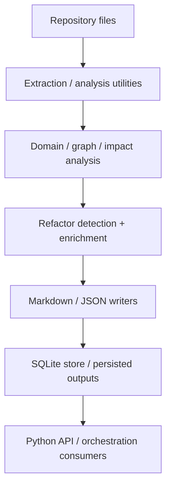

# Python Core Modules Overview

## Scope and purpose

This page documents the Python implementation under `src/rekipedia`, with emphasis on the main package groups that make up the Python-side pipeline:

- **Sandbox tasks** for one-off analysis jobs and repository-specific experiments
- **Analysis and extraction utilities** that inspect source trees, derive relationships, and prepare structured outputs
- **Repository processing** helpers that traverse repositories, build snapshots, and manage search/index-friendly data
- **Shared helpers and contracts** used across multiple Python modules

The repository analysis data shows a fairly broad Python surface area, but the most clearly observable core lives in `src/rekipedia/analysis`, `src/rekipedia/api.py`, `src/rekipedia/models/contracts.py`, `src/rekipedia/orchestrator/*`, `src/rekipedia/storage/sqlite_store.py`, and `src/rekipedia/llm/client.py`. The Go implementation is present in the repository, but this page intentionally focuses on Python; Go entrypoints are only mentioned where they call into Python-oriented core paths.

A useful way to think about the Python implementation is as a layered pipeline:

1. repository content is discovered and summarized,
2. analysis functions infer structure and relationships,
3. enriched results are formatted or stored,
4. API/orchestrator functions expose those results to callers.

> **Sources:** `src/rekipedia/__init__.py` · L1–L1 · [`rekipedia.__init__`](src/rekipedia/__init__.py#L1) · `src/rekipedia/analysis/biz_domain.py` · L1–L154 · [`rekipedia.analysis.biz_domain`](src/rekipedia/analysis/biz_domain.py#L1)

## Python package map

The observed Python packages fall into a few responsibility clusters.

### Analysis package

The `src/rekipedia/analysis` package contains the richest Python logic. The analysis modules include:

- [`rekipedia.analysis.biz_domain`](src/rekipedia/analysis/biz_domain.py#L1) — business-domain extraction and graph modeling
- [`rekipedia.analysis.cross_repo_search`](src/rekipedia/analysis/cross_repo_search.py#L1) — tokenization, BM25-style ranking, and multi-repo search
- [`rekipedia.analysis.domain`](src/rekipedia/analysis/domain.py#L1) — file-level domain classification
- [`rekipedia.analysis.graph_analysis`](src/rekipedia/analysis/graph_analysis.py#L1) — graph-oriented derived views such as hubs and knowledge gaps
- [`rekipedia.analysis.graph_export`](src/rekipedia/analysis/graph_export.py#L1) — GraphML / Cypher / Obsidian-style exports
- [`rekipedia.analysis.impact`](src/rekipedia/analysis/impact.py#L1) — direct and transitive impact analysis
- [`rekipedia.analysis.onboard`](src/rekipedia/analysis/onboard.py#L1) — onboarding guide generation
- [`rekipedia.analysis.refactor_applier`](src/rekipedia/analysis/refactor_applier.py#L1) — applying refactor actions to files
- [`rekipedia.analysis.refactor_detector`](src/rekipedia/analysis/refactor_detector.py#L1) — detecting refactor smells
- [`rekipedia.analysis.refactor_enricher`](src/rekipedia/analysis/refactor_enricher.py#L1) — enriching findings with callers/notes/LLM context
- [`rekipedia.analysis.refactor_writer`](src/rekipedia/analysis/refactor_writer.py#L1) — producing Markdown/JSON outputs
- [`rekipedia.analysis.resolution`](src/rekipedia/analysis/resolution.py#L1) — resolving relationships into concrete records
- [`rekipedia.analysis.tour`](src/rekipedia/analysis/tour.py#L1) — generating a repository tour

A key point from the relationship data is that these modules mostly depend on shared models (`rekipedia.models.contracts`) and, in a few places, on the storage and LLM layers. The analysis layer is therefore the main place where semantic work happens.

### API and orchestration

The Python API layer is centered on [`rekipedia.api`](src/rekipedia/api.py#L1), which imports the orchestrator routines and store access. This is a thin integration layer rather than the main algorithmic surface, but it is important because it exposes the results of analysis and orchestration in structured form.

The orchestration layer is represented in the analysis data by files such as:

- `src/rekipedia/orchestrator/run_digest.py`
- `src/rekipedia/orchestrator/run_ask.py`

These modules are more about coordinating the analysis pipeline than implementing core extraction logic themselves.

### Models, storage, and LLM

Shared data contracts live in [`rekipedia.models.contracts`](src/rekipedia/models/contracts.py#L1), while persistence is handled by [`rekipedia.storage.sqlite_store`](src/rekipedia/storage/sqlite_store.py#L1). LLM connectivity is encapsulated in [`rekipedia.llm.client`](src/rekipedia/llm/client.py#L1). Together these form the support infrastructure used by the analysis modules.

> **Sources:** `src/rekipedia/analysis/biz_domain.py` · L1–L154 · [`rekipedia.analysis.biz_domain`](src/rekipedia/analysis/biz_domain.py#L1); `src/rekipedia/analysis/cross_repo_search.py` · L1–L43 · [`rekipedia.analysis.cross_repo_search`](src/rekipedia/analysis/cross_repo_search.py#L1); `src/rekipedia/analysis/domain.py` · L1–L1 · [`rekipedia.analysis.domain`](src/rekipedia/analysis/domain.py#L1); `src/rekipedia/api.py` · L1–L1 · [`rekipedia.api`](src/rekipedia/api.py#L1)

## Responsibilities by package

### Sandbox tasks

The task entrypoint explicitly names [`src/rekipedia/sandbox/tasks/analyze_shard.py`](src/rekipedia/sandbox/tasks/analyze_shard.py) as an entry point. The analysis payload does not provide symbol-level detail for that file, so the only safe conclusion is that it acts as a sandboxed task runner for shard-focused analysis. It should be treated as an operational wrapper rather than core algorithmic logic.

What is observable from the broader Python implementation is that shard-oriented work in the codebase aligns with orchestration and analysis modules that accept repository slices, structured models, and store handles. In other words, `analyze_shard.py` likely sits at the edge of the pipeline and invokes the core analysis routines rather than implementing them.

### Analysis and extraction utilities

This is the most important Python area. Several modules do focused analytical work:

- [`rekipedia.analysis.domain`](src/rekipedia/analysis/domain.py#L1) classifies files into higher-level domains.
- [`rekipedia.analysis.graph_analysis`](src/rekipedia/analysis/graph_analysis.py#L1) computes graph-derived views such as hubs and knowledge gaps.
- [`rekipedia.analysis.cross_repo_search`](src/rekipedia/analysis/cross_repo_search.py#L1) tokenizes symbols and ranks matches across repositories.
- [`rekipedia.analysis.impact`](src/rekipedia/analysis/impact.py#L1) computes impact sets.
- [`rekipedia.analysis.refactor_detector`](src/rekipedia/analysis/refactor_detector.py#L1) and [`rekipedia.analysis.refactor_enricher`](src/rekipedia/analysis/refactor_enricher.py#L1) identify and enrich refactor opportunities.

These modules are data-driven and mostly operate on the shared model layer rather than on concrete storage or UI concerns. They are also where most of the utility-style helper functions live, for example:

- [`_tokenize_symbol`](src/rekipedia/analysis/cross_repo_search.py#L11) in cross-repo search
- [`_classify_file`](src/rekipedia/analysis/domain.py#L11) in domain classification
- [`detect_god_nodes`](src/rekipedia/analysis/refactor_detector.py#L62) in refactor detection
- [`_build_prompt`](src/rekipedia/analysis/refactor_enricher.py#L469) in enrichment
- [`_build_markdown`](src/rekipedia/analysis/refactor_writer.py#L156) in output generation

### Repository processing

The repository-processing story is split across several modules:

- [`rekipedia.analysis.onboard`](src/rekipedia/analysis/onboard.py#L1) generates a human-readable onboarding guide from repository structure.
- [`rekipedia.analysis.tour`](src/rekipedia/analysis/tour.py#L1) builds a tour of symbols and relationships.
- [`rekipedia.analysis.resolution`](src/rekipedia/analysis/resolution.py#L1) resolves relationships into richer records.
- [`rekipedia.api`](src/rekipedia/api.py#L1) aggregates wiki pages and citations for downstream use.
- [`rekipedia.storage.sqlite_store`](src/rekipedia/storage/sqlite_store.py#L1) persists runs, symbols, relationships, pages, notes, manifests, and trees.

This layer is where the code turns extracted facts into durable project state. The storage module is especially central because many analysis and orchestration functions expect a `SqliteStore`-style backend or equivalent store facade.

### Shared helpers and contracts

Shared types are declared in [`rekipedia.models.contracts`](src/rekipedia/models/contracts.py#L1). These contracts define the common vocabulary used across analysis, storage, API, and synthesis-like functionality. The analysis data confirms the presence of types such as `LLMConfig`, `Symbol`, `Relationship`, `AnalysisResult`, `Shard`, `WikiPageSpec`, `WikiPlan`, and `ScanMeta` in the shared contract layer.

Two helper categories recur throughout the code:

1. **string/path helpers** — parsing slugs, titles, and file paths
2. **collection helpers** — deduplication, sorting, grouping, and filtering

The result is a Python core that is relatively compact at the contract boundary but quite rich in derived-logic functions.

> **Sources:** `src/rekipedia/analysis/domain.py` · L1–L1 · [`rekipedia.analysis.domain`](src/rekipedia/analysis/domain.py#L1); `src/rekipedia/analysis/graph_analysis.py` · L1–L1 · [`rekipedia.analysis.graph_analysis`](src/rekipedia/analysis/graph_analysis.py#L1); `src/rekipedia/analysis/impact.py` · L1–L1 · [`rekipedia.analysis.impact`](src/rekipedia/analysis/impact.py#L1); `src/rekipedia/models/contracts.py` · L1–L1 · [`rekipedia.models.contracts`](src/rekipedia/models/contracts.py#L1)

## Python processing pipeline

The Python-side flow can be summarized as a narrow pipeline from repository facts to enriched analysis outputs.

This diagram is intentionally high level. The analysis data shows that the real implementations are split across many modules, but the dependency pattern is clear: analysis produces structured results, writers and storage persist them, and the API/orchestrator layer consumes them.

> **Sources:** `src/rekipedia/analysis/refactor_writer.py` · L1–L263 · [`_build_markdown`](src/rekipedia/analysis/refactor_writer.py#L156) · [`write_refactor_outputs`](src/rekipedia/analysis/refactor_writer.py#L54); `src/rekipedia/api.py` · L1–L1 · [`rekipedia.api`](src/rekipedia/api.py#L1); `src/rekipedia/storage/sqlite_store.py` · L1–L1 · [`rekipedia.storage.sqlite_store`](src/rekipedia/storage/sqlite_store.py#L1)

## Cross-module dependency table

The table below summarizes the major Python module relationships visible in the analysis data. For compactness, it focuses on the main implementation modules under `src/rekipedia`.

| Module | Imports From | Called By | Calls Into | Inherits From |
|--------|-------------|-----------|------------|---------------|
| `rekipedia.analysis.biz_domain` | `rekipedia.models.contracts`, `rekipedia.llm.client` | API/orchestrator consumers | LLM client, model validation | `BaseModel` types |
| `rekipedia.analysis.cross_repo_search` | `rekipedia.storage.sqlite_store`, `rekipedia.watcher.watcher` | multi-repo search consumers | store lookups, token scoring | — |
| `rekipedia.analysis.domain` | shared contracts/models | onboarding and analysis consumers | symbol/relationship scans | — |
| `rekipedia.analysis.graph_analysis` | shared contracts/models | graph-related analysis consumers | symbol/relationship aggregation | — |
| `rekipedia.analysis.graph_export` | shared contracts/models | graph export callers | GraphML/Cypher/Markdown-style serialization | — |
| `rekipedia.analysis.impact` | shared contracts/models | impact analysis consumers | BFS-style traversal helpers | — |
| `rekipedia.analysis.onboard` | `rekipedia.analysis.domain`, `rekipedia.storage.sqlite_store` | task/pipeline callers | repository classification, store queries | — |
| `rekipedia.analysis.refactor_applier` | shared contracts/models | refactor workflow callers | file rewrite helpers | — |
| `rekipedia.analysis.refactor_detector` | shared contracts/models | refactor enrichment/writers | relationship scans, smell detectors | — |
| `rekipedia.analysis.refactor_enricher` | `rekipedia.llm.client`, shared contracts/models | refactor writers / orchestration | LLM calls, cycle detection | — |
| `rekipedia.analysis.refactor_writer` | shared contracts/models | orchestration / output writers | Markdown/JSON file emission | — |
| `rekipedia.analysis.resolution` | shared contracts/models | analysis pipelines | relationship normalization | — |
| `rekipedia.analysis.tour` | shared contracts/models, `rekipedia.analysis.domain` | repository tour generation | symbol formatting, description building | — |
| `rekipedia.api` | `rekipedia.orchestrator.*`, `rekipedia.storage.sqlite_store` | external callers | page collection, citation parsing | — |

This matrix shows that the Python core is deliberately centralized around shared contracts and a small number of service modules. The biggest practical dependency hubs are the shared models, the storage layer, and the LLM client.

> **Sources:** `src/rekipedia/analysis/biz_domain.py` · L1–L154 · [`BizDomainAnalyzer`](src/rekipedia/analysis/biz_domain.py#L54); `src/rekipedia/analysis/cross_repo_search.py` · L1–L43 · [`search_all_repos`](src/rekipedia/analysis/cross_repo_search.py#L43); `src/rekipedia/analysis/onboard.py` · L1–L1 · [`build_onboard_guide`](src/rekipedia/analysis/onboard.py); `src/rekipedia/api.py` · L1–L1 · [`rekipedia.api`](src/rekipedia/api.py#L1)

## Important implementation-only symbols

The table below highlights the most important implementation-only Python classes and functions evidenced in the analysis data. It intentionally excludes benchmark fixtures and Go-side logic except where they are indirectly relevant to Python core behavior.

| Symbol | Kind | File | Responsibility |
|--------|------|------|----------------|
| [`BizDomainGraph`](src/rekipedia/analysis/biz_domain.py#L54) | class | `src/rekipedia/analysis/biz_domain.py` | Pydantic model for extracted business-domain graph data |
| [`BizDomainAnalyzer`](src/rekipedia/analysis/biz_domain.py#L54) | class | `src/rekipedia/analysis/biz_domain.py` | Builds prompts, calls the LLM, parses responses, and saves results |
| [`_build_prompt`](src/rekipedia/analysis/biz_domain.py#L100) | function | `src/rekipedia/analysis/biz_domain.py` | Constructs the LLM prompt from repository context |
| [`_parse_response`](src/rekipedia/analysis/biz_domain.py#L135) | function | `src/rekipedia/analysis/biz_domain.py` | Parses and validates model output into `BizDomainGraph` |
| [`_now`](src/rekipedia/analysis/biz_domain.py#L154) | function | `src/rekipedia/analysis/biz_domain.py` | Timestamp helper used by the analyzer |
| [`_tokenize_symbol`](src/rekipedia/analysis/cross_repo_search.py#L11) | function | `src/rekipedia/analysis/cross_repo_search.py` | Splits symbol names into searchable tokens |
| [`_compute_idf`](src/rekipedia/analysis/cross_repo_search.py#L21) | function | `src/rekipedia/analysis/cross_repo_search.py` | Computes inverse document frequency scores |
| [`_score_bm25`](src/rekipedia/analysis/cross_repo_search.py#L43) | function | `src/rekipedia/analysis/cross_repo_search.py` | Scores symbol matches with a BM25-like heuristic |
| [`_classify_file`](src/rekipedia/analysis/domain.py#L11) | function | `src/rekipedia/analysis/domain.py#L11` | Classifies a file into a high-level domain |
| [`compute_god_nodes`](src/rekipedia/analysis/graph_analysis.py#L1) | function | `src/rekipedia/analysis/graph_analysis.py` | Computes top-degree or “god” nodes from graph data |
| [`_build_knowledge_gaps`](src/rekipedia/analysis/graph_analysis.py#L1) | function | `src/rekipedia/analysis/graph_analysis.py` | Derives likely knowledge gaps from graph relationships |
| [`_tokenize_symbol`](src/rekipedia/analysis/cross_repo_search.py#L11) | function | `src/rekipedia/analysis/cross_repo_search.py` | Tokenization helper for repo search |
| [`detect_god_nodes`](src/rekipedia/analysis/refactor_detector.py#L62) | function | `src/rekipedia/analysis/refactor_detector.py` | Detects overly central symbols |
| [`detect_circular_deps`](src/rekipedia/analysis/refactor_detector.py#L134) | function | `src/rekipedia/analysis/refactor_detector.py` | Detects cycles in relationship graphs |
| [`detect_dead_code`](src/rekipedia/analysis/refactor_detector.py#L199) | function | `src/rekipedia/analysis/refactor_detector.py` | Flags unreferenced symbols with heuristics for exported names |
| [`detect_high_fan_in`](src/rekipedia/analysis/refactor_detector.py#L229) | function | `src/rekipedia/analysis/refactor_detector.py` | Detects high fan-in symbols |
| [`detect_high_fan_out`](src/rekipedia/analysis/refactor_detector.py#L266) | function | `src/rekipedia/analysis/refactor_detector.py` | Detects high fan-out symbols |
| [`detect_deep_inheritance`](src/rekipedia/analysis/refactor_detector.py#L303) | function | `src/rekipedia/analysis/refactor_detector.py` | Detects deep inheritance chains |
| [`RefactorEnricher`](src/rekipedia/analysis/refactor_enricher.py#L296) | class | `src/rekipedia/analysis/refactor_enricher.py` | Coordinates enrichment of detected findings |
| [`_build_prompt`](src/rekipedia/analysis/refactor_enricher.py#L469) | function | `src/rekipedia/analysis/refactor_enricher.py` | Builds LLM prompts for enrichment |
| [`_parse_enrichment`](src/rekipedia/analysis/refactor_enricher.py#L492) | function | `src/rekipedia/analysis/refactor_enricher.py` | Parses enrichment responses |
| [`_attach_callers`](src/rekipedia/analysis/refactor_enricher.py#L323) | function | `src/rekipedia/analysis/refactor_enricher.py` | Adds caller information to findings |
| [`_attach_notes`](src/rekipedia/analysis/refactor_enricher.py#L352) | function | `src/rekipedia/analysis/refactor_enricher.py` | Attaches note records to findings |
| [`_build_markdown`](src/rekipedia/analysis/refactor_writer.py#L156) | function | `src/rekipedia/analysis/refactor_writer.py` | Formats detected issues as Markdown |
| [`write_refactor_outputs`](src/rekipedia/analysis/refactor_writer.py#L54) | function | `src/rekipedia/analysis/refactor_writer.py` | Writes JSON and Markdown outputs |
| [`resolve_relationships`](src/rekipedia/analysis/resolution.py#L1) | function | `src/rekipedia/analysis/resolution.py` | Normalizes relationships into resolved records |
| [`build_tour`](src/rekipedia/analysis/tour.py#L18) | function | `src/rekipedia/analysis/tour.py` | Builds a repository tour from symbols and relationships |
| [`AskResult`](src/rekipedia/api.py#L83) | class | `src/rekipedia/api.py` | Wrapper/response model used by API-side ask flows |
| [`_parse_citations`](src/rekipedia/api.py#L83) | function | `src/rekipedia/api.py` | Extracts citation markers from generated text |
| [`_collect_wiki_pages`](src/rekipedia/api.py#L83) | function | `src/rekipedia/api.py` | Collects rendered wiki pages from storage/output |

> **Sources:** `src/rekipedia/analysis/biz_domain.py` · L54–L154 · [`BizDomainAnalyzer`](src/rekipedia/analysis/biz_domain.py#L54); `src/rekipedia/analysis/cross_repo_search.py` · L11–L43 · [`_tokenize_symbol`](src/rekipedia/analysis/cross_repo_search.py#L11); `src/rekipedia/analysis/refactor_detector.py` · L62–L303 · [`detect_all`](src/rekipedia/analysis/refactor_detector.py#L303); `src/rekipedia/analysis/refactor_enricher.py` · L296–L492 · [`RefactorEnricher`](src/rekipedia/analysis/refactor_enricher.py#L296); `src/rekipedia/analysis/refactor_writer.py` · L54–L263 · [`write_refactor_outputs`](src/rekipedia/analysis/refactor_writer.py#L54)

## Key observations and gaps

A few limitations are worth calling out honestly:

- The analysis payload is much richer for Python analysis utilities than for sandbox tasks, so `src/rekipedia/sandbox/tasks/analyze_shard.py` cannot be described in depth beyond its observed role as a task entrypoint.
- Some symbol names in the payload are only partially line-resolved or have truncated line ends; citations therefore point to the best available start line and file.
- The benchmark fixtures under `benchmarks/fixtures/*` are intentionally omitted here except where they are referenced by benchmark code that exercises the Python core.

Even with those gaps, the observable architecture is clear: Python implements the domain logic, search/ranking, refactor analysis, and output formatting, while storage and orchestration provide the durable and operational scaffolding around those algorithms.

> **Sources:** `benchmarks/run_extraction.py` · L19–L112 · [`run_extraction_benchmark`](benchmarks/run_extraction.py#L19); `src/rekipedia/sandbox/tasks/analyze_shard.py` · entry point only; `src/rekipedia/analysis/biz_domain.py` · L54–L154 · [`BizDomainAnalyzer`](src/rekipedia/analysis/biz_domain.py#L54)