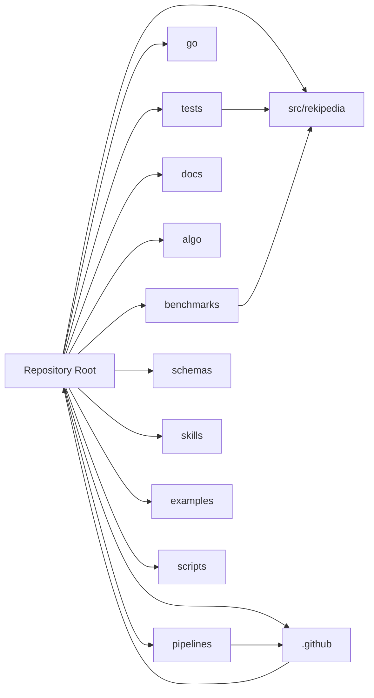

# Repository Map

## Overview

This page provides a complete, top-level map of the repository: the major directories, the most important root files, and how the project’s Python and Go implementations fit together. It is intentionally broad rather than deep; for detailed subsystem behavior, see the dedicated architecture and API pages.

The codebase is organized around a dual-runtime layout:

- **Python package** under `src/rekipedia` with corresponding `tests/`
- **Go implementation** under `go/`, including `go/cmd/rekipedia` and `go/internal/...`
- Supporting areas for **benchmarks**, **docs**, **pipelines**, **fixtures**, and **automation**

Several root-level files indicate the repository’s operational shape: `pyproject.toml`, `package.json`, `Makefile`, `README.md`, `action.yml`, and release/config files such as `.goreleaser.yaml` and `.github/workflows/*.yml`. The repository also includes analysis-oriented documentation under `algo/` and operational guidance under `skills/` and `.github/`.

> **Sources:** `README.md` · `pyproject.toml` · `package.json` · `Makefile` · `action.yml` · `go/go.mod` · `src/rekipedia/__init__.py`

## Annotated Repository Tree

```text
.
├── src/rekipedia/                # Primary Python package
│   ├── analysis/                 # Analysis and refactor logic
│   ├── cli/                      # CLI entry points and subcommands
│   ├── config/                   # Configuration loading
│   ├── exporters/                # HTML/JSON/Markdown output
│   ├── extractors/               # Multi-language extraction
│   ├── llm/                      # LLM client integration
│   ├── models/                   # Shared contracts and DTOs
│   ├── notes/                    # Notes import/store helpers
│   ├── orchestrator/             # High-level workflows
│   ├── rag/                      # Retrieval/chunking/vector store
│   ├── sandbox/                  # Sandbox execution helpers
│   ├── server/                   # Web server, templates, static assets
│   ├── storage/                  # SQLite persistence and migrations
│   ├── synthesis/                # Wiki/page/diagram generation
│   ├── utils/                    # Shared utilities
│   └── watcher/                  # Filesystem watch loop
├── tests/                        # Python test suite + fixtures
│   ├── fixtures/mini-py-repo/     # Minimal Python fixture repo
│   └── fixtures/mini-ts-repo/     # Minimal TypeScript fixture repo
├── go/                           # Go implementation and CLI
│   ├── cmd/rekipedia/            # Cobra-style command wiring
│   ├── internal/                 # Core subsystems mirrored in Go
│   └── pkg/fsutil/               # Public helper package
├── benchmarks/                   # Extraction performance benchmarks
│   └── fixtures/                 # Benchmark fixture repos
├── docs/                         # Product/docs/planning material
├── algo/                         # Algorithm/design notes
├── pipelines/                    # Harness pipeline definitions
├── schemas/                      # JSON schema definitions
├── skills/                       # Harness/collaboration instructions
├── scripts/                      # Utility scripts
├── .github/                      # Workflows and repo instructions
├── examples/                     # Example configuration files
└── root files                    # Build, config, release, and policy files
```

The root files most relevant to day-to-day work include:

| File | Role |
|---|---|
| `README.md`, `README.zh-CN.md`, `README.zh-TW.md` | Primary project documentation in multiple languages |
| `pyproject.toml`, `uv.lock` | Python packaging and dependency lockfile |
| `go/go.mod`, `go/go.sum` | Go module definition and dependency lockfile |
| `Makefile`, `go/Makefile` | Root and Go-specific task automation |
| `package.json` | Node-based tooling / repo integration |
| `action.yml` | GitHub Action entrypoint |
| `Dockerfile.sandbox`, `go/Dockerfile` | Containerized runtime/build environments |
| `.github/workflows/*.yml` | CI, release, benchmark, and publish pipelines |
| `.pre-commit-config.yaml`, `.golangci.yml`, `.eslintrc.json`, `.prettierrc.json` | Code quality and formatting rules |

> **Sources:** `src/rekipedia/__init__.py` · `tests/__init__.py` · `go/go.mod` · `benchmarks/__init__.py` · `docs/PLAN.md` · `pipelines/harness-ci.yaml` · `.github/workflows/python-ci.yml`

## Directory Summary Table

| Directory | Purpose | Key Files | Languages |
|---|---|---|---|
| `src/rekipedia/` | Main Python application package covering CLI, analysis, storage, RAG, server, and synthesis | `src/rekipedia/__main__.py`, `src/rekipedia/api.py`, `src/rekipedia/cli/*.py`, `src/rekipedia/server/app.py`, `src/rekipedia/storage/sqlite_store.py` | Python |
| `tests/` | Python test suite and fixture repositories used for integration-style validation | `tests/test_*.py`, `tests/fixtures/mini-py-repo/*`, `tests/fixtures/mini-ts-repo/*` | Python, TypeScript fixture content |
| `go/` | Go reimplementation / companion CLI and internal subsystems | `go/cmd/rekipedia/main.go`, `go/cmd/rekipedia/cmd/*.go`, `go/internal/*`, `go/pkg/fsutil/walk.go` | Go |
| `benchmarks/` | Benchmark harness and sample repositories for extraction performance testing | `benchmarks/run_extraction.py`, `benchmarks/fixtures/python_web_app/app.py`, `benchmarks/fixtures/typescript_react/App.tsx` | Python, TypeScript fixture content |
| `docs/` | Planning documents, customization guidance, and phased roadmap notes | `docs/PLAN.md`, `docs/customizing.md`, `docs/plans/*.md` | Markdown |
| `algo/` | Design/algorithm notes for search, graphing, RAG, sharding, and planning | `algo/*.md` | Markdown |
| `pipelines/` | Harness pipeline definitions used in operational workflows | `pipelines/harness-*.yaml` | YAML |
| `schemas/` | Formal schemas for repository data structures | `schemas/analysis_result.schema.json` | JSON Schema |
| `skills/` | Instructional content for harness behaviors and review workflows | `skills/shared/*.md`, `skills/harness/*.md` | Markdown |
| `.github/` | Repository automation, instruction files, and CI/CD workflows | `.github/workflows/*.yml`, `.github/scripts/update-homebrew-tap.py`, `.github/*.instructions.md` | YAML, Python, Markdown |
| `examples/` | Example configuration artifacts for users | `examples/wiki.yml` | YAML |
| `scripts/` | Standalone operational scripts | `scripts/lint-and-report.sh` | Shell |
| root config files | Tooling, formatting, packaging, release, and policy configuration | `pyproject.toml`, `go/go.mod`, `package.json`, `Makefile`, `.pre-commit-config.yaml`, `.golangci.yml` | Mixed |

> **Sources:** `src/rekipedia/__main__.py` · `src/rekipedia/api.py` · `go/cmd/rekipedia/main.go` · `benchmarks/run_extraction.py` · `docs/PLAN.md` · `pipelines/harness-ci.yaml` · `schemas/analysis_result.schema.json`

## Dual-Language Layout

The repository intentionally maintains both Python and Go code paths.

### Python: `src/` + `tests/`

The Python side appears to be the primary application surface area, with the package rooted at `src/rekipedia`. Its subpackages reflect the product’s major concerns: analysis, extractors, orchestration, storage, server, synthesis, and RAG. The test suite under `tests/` is broad and mirrors those concerns with targeted unit and integration coverage, including extractor tests, storage tests, server tests, and end-to-end workflow tests.

The Python package also includes web-serving code in `src/rekipedia/server/`, persistence under `src/rekipedia/storage/`, and output generation under `src/rekipedia/exporters/` and `src/rekipedia/synthesis/`. This gives the Python tree a full application shape rather than a library-only shape.

### Go: `go/cmd`, `go/internal`, and `go/pkg`

The Go subtree provides a second implementation surface:

- `go/cmd/rekipedia/` wires CLI commands and subcommands
- `go/internal/` contains the core logic for analysis, extraction, orchestration, storage, server, synthesis, and related functionality
- `go/pkg/fsutil/` exposes a reusable filesystem helper package

The structure is conventional for a Go application: `cmd` for entrypoints, `internal` for application-private modules, and `pkg` for exported helper utilities.

### Fixtures and cross-language test data

The repository contains multiple fixture sets that deliberately exercise both languages and multiple file types:

- `tests/fixtures/mini-py-repo/` for a small Python repository
- `tests/fixtures/mini-ts-repo/` for a small TypeScript repository
- `benchmarks/fixtures/python_web_app/` and `benchmarks/fixtures/typescript_react/` for extraction performance baselines

These fixtures are important because the project’s extractors and analysis workflows are explicitly multi-language.

> **Sources:** `src/rekipedia/cli/__init__.py` · `src/rekipedia/extractors/base.py` · `tests/test_multilang_extractors.py` · `go/cmd/rekipedia/main.go` · `go/internal/extractor/extractor.go` · `benchmarks/run_extraction.py`

## How Docs, Benchmarks, and Pipelines Fit In

The non-code directories are not incidental; they support the repository’s product and delivery lifecycle.

### Documentation

`docs/` and `algo/` provide complementary documentation layers:

- `docs/` covers user-facing and roadmap-oriented material such as `docs/customizing.md` and `docs/plans/golang-rewrite.md`
- `algo/` captures implementation/design notes for capabilities such as BM25 search, graph analysis, incremental updates, sharding, and wiki planning

This separation suggests that `docs/` is more operational and product-oriented, while `algo/` is closer to internal design rationale.

### Benchmarks

`benchmarks/` contains both a benchmark runner (`benchmarks/run_extraction.py`) and fixture repositories. That layout indicates extraction performance is a first-class concern. The fixture repositories are intentionally minimal and likely serve as stable inputs for repeatable measurement.

### Pipelines and automation

`pipelines/` stores harness pipeline definitions, while `.github/workflows/` holds CI/release automation. Together they cover both local operational workflows and hosted automation. The presence of `.github/scripts/update-homebrew-tap.py` and release workflows also indicates the repository supports packaging/distribution workflows beyond ordinary test runs.

### Repository governance and tooling

Root-level files such as `AGENTS.md`, `CLAUDE.md`, `CONTRIBUTING.md`, and `.github/*.instructions.md` provide process guidance for humans and automation agents. Tooling config files (`.pre-commit-config.yaml`, `.golangci.yml`, `.eslintrc.json`, `.prettierrc.json`) establish linting and formatting expectations across the mixed-language stack.

> **Sources:** `docs/PLAN.md` · `docs/customizing.md` · `docs/plans/golang-rewrite.md` · `algo/README.md` · `benchmarks/run_extraction.py` · `pipelines/harness-ci.yaml` · `.github/workflows/python-ci.yml` · `.github/workflows/go-ci.yml`

## Top-Level Area Relationship Graph



This graph is intentionally shallow. It shows the repository’s major top-level areas without duplicating the deeper module architecture or endpoint-level API mappings described elsewhere.

> **Sources:** `src/rekipedia/__init__.py` · `tests/__init__.py` · `go/go.mod` · `benchmarks/__init__.py` · `docs/PLAN.md` · `.github/workflows/python-ci.yml` · `pipelines/harness-ci.yaml`